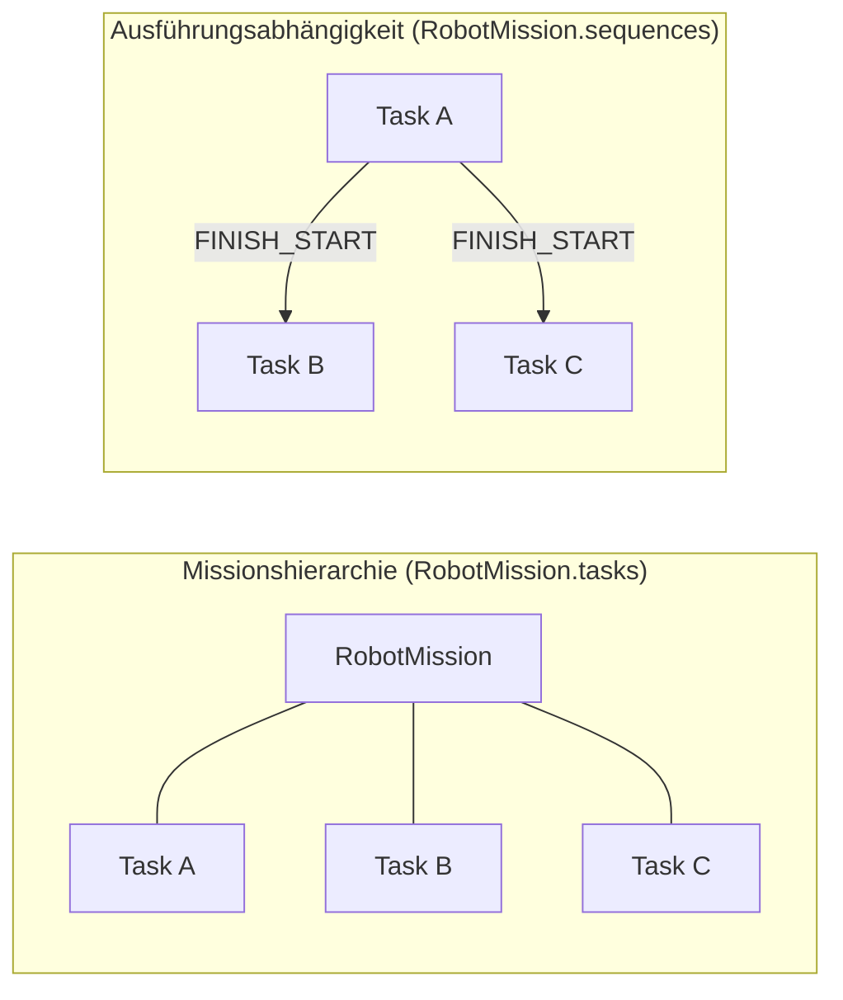

# Arbeitsnotiz: untersuchte Repository-Dateien

Primär geprüft:

- `src/domain/robot-tasks/types.ts` (Struktur von `RobotMission`, `RobotTask`, `RobotTaskSequence`, `RobotTaskSequenceType`)
- `src/domain/robot-tasks/sequencing.ts` (`createTaskSequence`, `addTaskSequence`, `validateTaskSequence`, `hasTaskSequenceCycle`, `getTasksInExecutionOrder`, `setMissionTaskExecutionOrder`)
- `src/domain/robot-tasks/validation.ts` (`validateMission`, Task-ID-Eindeutigkeit, Einbindung der Sequenzvalidierung)
- `src/domain/robot-tasks/builders.ts` (`createRobotMission`, `addTaskToMission`)

Ergänzend geprüft:

- `src/application/robot-tasks/robotMissionService.ts` (`sequenceTasks`, `setTaskExecutionOrder`, Kantenbereinigung in `deleteTask`)
- `src/ui-templates/sections/robot-mission-tasks.ts` (tatsächlich angebotene Bedienung der Reihenfolge)
- `src/ifc/robot-tasks/mapper.ts` (nur zur Bestätigung der verwendeten IFC-Relationen)

Zur Orientierung: `REPOSITORY_MAP_IFC_EDITOR_674ede3.md`, `Strukturübersicht.txt`, `repo_structure.txt`.

---

# 4.5 Missionshierarchie und Task-Sequenzen

Eine Robotermission besteht aus mehreren ausführbaren Einzelschritten. Für deren Beschreibung sind zwei Fragen zu beantworten, die auf den ersten Blick zusammenfallen, semantisch jedoch verschieden sind: Welche Schritte gehören zu einer Mission, und in welcher Abhängigkeit stehen diese Schritte zueinander? Das in dieser Arbeit entworfene Domänenmodell beantwortet beide Fragen getrennt. `RobotMission.tasks` bestimmt die Zugehörigkeit der Schritte zur Mission sowie deren deterministische Darstellungsordnung, `RobotMission.sequences` beschreibt die Ausführungsabhängigkeiten zwischen diesen Schritten.

## Missionshierarchie

`RobotMission` bildet die übergeordnete Einheit einer zusammengehörigen Folge von Roboteraktivitäten und fasst mehrere `RobotTask`-Objekte als ausführbare Kindelemente zusammen (vgl. Abschnitt 4.2). Jeder Task besitzt eine stabile, anwendungsseitig vergebene Kennung. Diese Kennung muss innerhalb einer Mission eindeutig sein, da sie als Bezugspunkt aller weiteren Beziehungen dient: Das Hinzufügen eines Tasks wird bei bereits vergebener Kennung mit einem Domänenfehler abgewiesen, und die Missionsvalidierung meldet doppelte Task-IDs als blockierenden Fehler. Die Eindeutigkeit ist damit keine Konvention, sondern eine geprüfte Invariante des Modells.

Das Feld `tasks` repräsentiert ausschließlich die enthaltenen Schritte. Es trägt zwar eine Reihenfolge, weil es als Liste realisiert ist, doch diese Reihenfolge besitzt keine eigenständige Ausführungssemantik. Sie dient der reproduzierbaren Darstellung und als stabiles Ordnungskriterium dort, wo die Abhängigkeitsbeziehungen keine eindeutige Aussage treffen.

## Task-Sequenzen

Eine `RobotTaskSequence` beschreibt eine gerichtete Beziehung zwischen genau zwei Tasks. Sie besitzt eine eigene Kennung `id`, verweist über `predecessorTaskId` auf den Vorgänger und über `successorTaskId` auf den Nachfolger und trägt mit `sequenceType` die Art der zeitlichen Abhängigkeit. Der Vorgänger ist derjenige Task, dessen Zustand die Ausführbarkeit des Nachfolgers einschränkt; der Nachfolger ist der eingeschränkte Task.

Entscheidend ist, dass eine Sequenz keine Zugehörigkeitsaussage trifft. Sie erklärt einen Task nicht zum Bestandteil einer Mission, sondern setzt zwei bereits zur Mission gehörende Tasks zueinander in Beziehung. Beide Endpunkte müssen deshalb auf Tasks verweisen, die in `tasks` enthalten sind. Umgekehrt kann ein Task ohne jede Sequenzbeziehung existieren; er ist dann Bestandteil der Mission, aber zeitlich ungebunden. Genau diese Asymmetrie zeigt, dass sich beide Informationen nicht durch die Position eines Tasks in einem einzigen Array ausdrücken lassen: Eine Arrayposition kann weder ausdrücken, dass zwei Schritte unabhängig voneinander ausführbar sind, noch welche Art der zeitlichen Kopplung zwischen zwei gekoppelten Schritten gilt.

## Sequenztypen

Das Modell unterstützt die Beziehungsarten `FINISH_START`, `START_START`, `FINISH_FINISH` und `START_FINISH`. Sie beschreiben, welche Zustandsübergänge des Vorgängers den Beginn oder das Ende des Nachfolgers freigeben. Im Zentrum der prototypischen Umsetzung steht `FINISH_START`: Der Nachfolger darf erst beginnen, nachdem der Vorgänger abgeschlossen wurde. Diese Beziehung ist der Standardwert bei der Erzeugung einer Sequenz und deckt den typischen Fall einer linearen Missionsausführung ab:

```text
Task A: Tür öffnen
        ↓ FINISH_START
Task B: Tür passieren
```

Die übrigen drei Typen sind im Datenmodell vorhanden und werden bei der Anzeige unverändert übernommen. Sie belegen, dass das Domänenmodell grundsätzlich auch überlappende oder endebezogene Kopplungen ausdrücken kann; eine gesonderte Auswertung dieser Semantik findet im gegenwärtigen Stand jedoch nicht statt.

## Lineare Reihenfolge und allgemeiner Abhängigkeitsgraph

Eine einfache Bedienoberfläche kann eine Mission als lineare Folge darstellen. Der Prototyp verfährt genau so: Beim Verschieben eines Tasks wird der gesamte Missionsplan als vollständige Kette von `FINISH_START`-Beziehungen neu erzeugt, wobei zugleich die Hierarchieordnung der Tasks an die gewünschte Reihenfolge angeglichen wird. Das Ersetzen statt Ergänzen der Kanten verhindert, dass veraltete Beziehungen nach einer Umsortierung Widersprüche erzeugen.

Das zugrunde liegende Modell ist jedoch allgemeiner. Sequenzen werden als gerichteter Graph geführt und einzeln hinzugefügt; die Prüfung beschränkt sich auf Endpunktexistenz, Selbstbezug und Zyklenfreiheit. Verzweigte Strukturen – ein Vorgänger mit mehreren Nachfolgern oder ein Nachfolger mit mehreren Vorgängern – sind daher auf Domänenebene zulässig und werden bei der Ermittlung der Ausführungsreihenfolge auch berücksichtigt: Die Reihenfolge wird topologisch bestimmt, wobei die Hierarchieordnung aus `tasks` als stabiles Kriterium zwischen unabhängigen Zweigen dient. Damit wird die Arbeitsteilung zwischen beiden Feldern unmittelbar sichtbar. Die Bearbeitung solcher verzweigter Missionsgraphen wird von der aktuellen Oberfläche allerdings nicht angeboten; dort steht ausschließlich die lineare Umsortierung zur Verfügung.

*Abbildung 4.5-1 (Position: unmittelbar nach diesem Absatz)* stellt beide Informationsebenen gegenüber.



**Abbildung 4.5-1:** Trennung von Zugehörigkeit und Abhängigkeit. Links bestimmt `tasks`, welche Schritte zur Mission gehören; rechts beschreibt `sequences`, welche Abhängigkeiten zwischen denselben Schritten gelten. Die dargestellte Verzweigung ist auf Domänenebene zulässig; die aktuelle Oberfläche erzeugt ausschließlich lineare Ketten.

## Strukturelle Konsistenz der Sequenzen

Da Sequenzen ausschließlich über Task-Kennungen definiert sind, ist ihre Gültigkeit an die Hierarchie gebunden und maschinell prüfbar. Geprüft werden das Vorhandensein einer nicht leeren Sequenz-ID, der Ausschluss von Selbstbezügen, die Auflösbarkeit beider Endpunkte auf bestehende Tasks sowie die Zyklenfreiheit des gesamten Graphen; beim Hinzufügen einer Sequenz wird zusätzlich die Eindeutigkeit der Sequenz-ID sichergestellt. Die Bedeutung der Zyklenfreiheit lässt sich unmittelbar einsehen: Eine Konstellation

```text
A → B → C → A
```

fordert von jedem beteiligten Task, vor sich selbst ausgeführt zu werden, und lässt daher keine widerspruchsfreie Ausführungsreihenfolge zu. Sie wird deshalb als Fehler zurückgewiesen. Die Einordnung dieser Prüfungen in die Gesamtarchitektur der Validierung erfolgt in Abschnitt 4.10.

## Bedeutung für die IFC-Abbildung

Die getrennte Führung beider Informationen im internen Modell ist keine reine Entwurfsvorliebe, sondern folgt der Zielrepräsentation. IFC unterscheidet dieselben beiden Aussagen durch verschiedene Beziehungsobjekte: Die Missionshierarchie wird konzeptionell auf `IfcRelNests` abgebildet, die Abhängigkeit zwischen zwei Tasks auf `IfcRelSequence`. Ein Domänenmodell, das Zugehörigkeit und Reihenfolge in einer einzigen geordneten Liste vermischte, müsste diese Unterscheidung beim Export erst rekonstruieren und beim Import erneut auflösen. Die vollständige Abbildung einschließlich der Attribute beider Relationen wird in Abschnitt 4.9 behandelt.

---

# Nachweistabelle

| Aussage | Status | Implementierungsnachweis |
| ------- | ------ | ------------------------ |
| `RobotMission` enthält Kindtasks in `tasks` und Abhängigkeiten getrennt in `sequences` | implementiert | `src/domain/robot-tasks/types.ts` (`RobotMission.tasks`, `RobotMission.sequences`) |
| Task-IDs sind stabil und innerhalb der Mission eindeutig | implementiert | `src/domain/robot-tasks/builders.ts` (`addTaskToMission`, Duplikatfehler); `src/domain/robot-tasks/validation.ts` (`TASK_ID_DUPLICATE`) |
| `RobotTaskSequence` besitzt `id`, `predecessorTaskId`, `successorTaskId`, `sequenceType` | implementiert | `src/domain/robot-tasks/types.ts` |
| Vier Sequenztypen sind definiert | implementiert | `src/domain/robot-tasks/types.ts` (`RobotTaskSequenceType`) |
| `FINISH_START` ist der Standardwert neuer Sequenzen | implementiert | `src/domain/robot-tasks/sequencing.ts` (`createTaskSequence`) |
| Übrige Sequenztypen werden gespeichert und angezeigt, aber nicht gesondert ausgewertet | aus Implementierung abgeleitet | `src/ui-templates/sections/robot-mission-tasks.ts` (Anzeige des gespeicherten Typs); keine typabhängige Auswertung in `sequencing.ts` |
| Lineare Reihenfolge wird als vollständige `FINISH_START`-Kette gespeichert und ersetzt bestehende Kanten | implementiert | `src/domain/robot-tasks/sequencing.ts` (`setMissionTaskExecutionOrder`); `src/application/robot-tasks/robotMissionService.ts` (`setTaskExecutionOrder`) |
| Verzweigte, azyklische Abhängigkeitsgraphen sind auf Domänenebene zulässig | aus Implementierung abgeleitet | `src/domain/robot-tasks/sequencing.ts` (`addTaskSequence` prüft nur ID-Eindeutigkeit und Graphgültigkeit); `src/application/robot-tasks/robotMissionService.ts` (`sequenceTasks`) |
| Ausführungsreihenfolge wird topologisch bestimmt, Hierarchieordnung dient als stabiles Nebenkriterium | implementiert | `src/domain/robot-tasks/sequencing.ts` (`getTasksInExecutionOrder`) |
| Aktuelle Oberfläche bietet ausschließlich lineare Umsortierung | aus Implementierung abgeleitet | `src/ui-templates/sections/robot-mission-tasks.ts` (nur `onMoveTask` über `setTaskExecutionOrder`) |
| Prüfung auf leere Sequenz-ID, Selbstbezug, unbekannte Endpunkte und Zyklen | implementiert | `src/domain/robot-tasks/sequencing.ts` (`validateTaskSequence`, `hasTaskSequenceCycle`) |
| Eindeutigkeit der Sequenz-ID | implementiert | `src/domain/robot-tasks/sequencing.ts` (`addTaskSequence`) |
| Kanten eines gelöschten Tasks werden entfernt | implementiert | `src/application/robot-tasks/robotMissionService.ts` (`deleteTask`) |
| Hierarchie → `IfcRelNests`, Abhängigkeit → `IfcRelSequence` | implementiert | `src/ifc/robot-tasks/mapper.ts` |
| Trennung erleichtert verlustfreie Rekonstruktion beim Import | konzeptionell | Argumentation dieses Abschnitts; technische Belege in Abschnitt 4.9 |

---

# Punkte für das manuelle Review

1. **Eindeutigkeit der Sequenz-ID:** Sie wird beim Hinzufügen einer Sequenz erzwungen, aber nicht in `validateTaskSequence` erneut geprüft. Falls Kapitel 4.10 dies anders darstellt, sollten beide Formulierungen abgeglichen werden.
2. **Reichweite der Aussage zu verzweigten Graphen:** Der Text belegt Verzweigungen über `addTaskSequence` und `getTasksInExecutionOrder`, schränkt die Bedienbarkeit aber ausdrücklich ein. Prüfen, ob diese Abgrenzung zur Formulierung in 4.12 („Grenzen des Annotationsmodells“) passt.
3. **Überschneidung mit 4.2 und 4.9:** Die Absätze zur Hierarchie berühren `RobotMission`/`RobotTask` und die IFC-Relationen bewusst nur knapp. Nach Fertigstellung von 4.2 und 4.9 auf Doppelungen gegenlesen.
