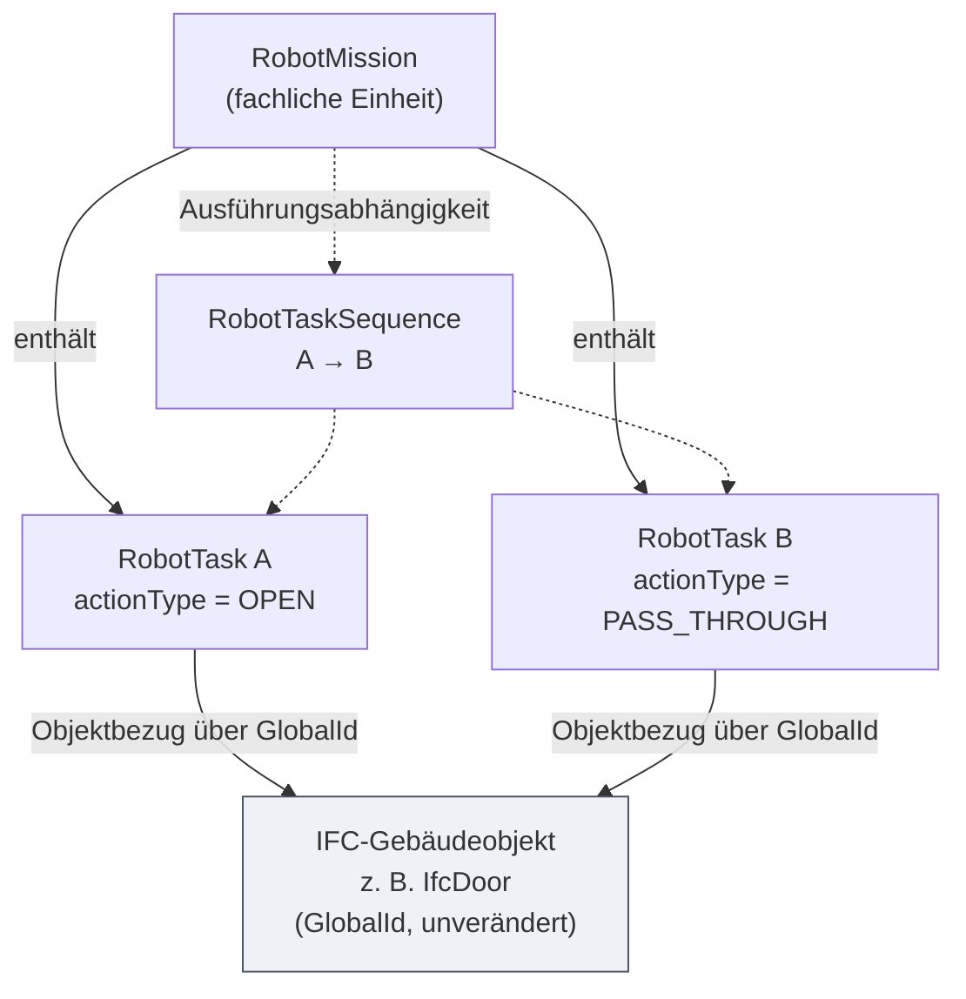
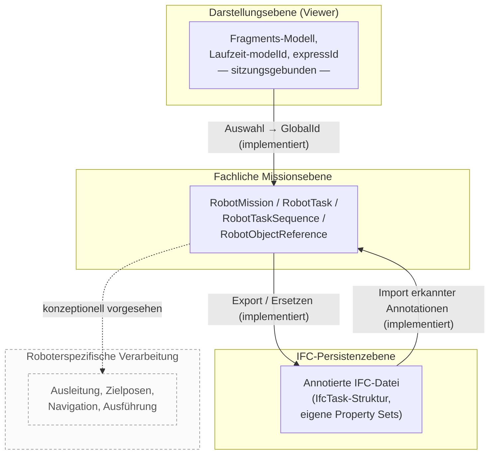

Jetzt sind alle Quelldateien direkt verfügbar. Ich lese die für Kapitel 4.1 zentralen Dateien.Nun die Repository-Map-Aktualisierung und die überarbeitete Strukturübersicht prüfen, um Abweichungen und den neuen Stand zu erfassen.Gut, HEAD entspricht dem Commit `674ede3` laut Map — aber der Nutzer nennt jetzt `0248fa89c8747d73fe7fd630f3ce74d79f2e2f6e` als tatsächlichen SHA. Ich prüfe die überarbeitete Strukturübersicht.txt auf Abweichungen, insbesondere Kap. 4.1.Gut, das bestätigt weitgehend meine vorige Einschätzung, nur jetzt konsistent und explizit belegt. Ich prüfe noch kurz Kapitel 4.1 der Gliederung in der überarbeiteten Version, falls sich dort etwas geändert hat.Jetzt habe ich ausreichend Grundlage. Ich schreibe Kapitel 4.1 neu, mit "Aufgabe" im Fließtext und `RobotTask` auf Codeebene, gestützt auf den direkt vorliegenden Quellcode.

---

## A. Kurze Recherche- und Implementierungsnotiz

*(nicht Bestandteil der Masterarbeit)*

- **Geprüfter Commit:** `0248fa89c8747d73fe7fd630f3ce74d79f2e2f6e` (aus `commit-id_notiz.txt`). Der Quellcode liegt nun als direkte Kopie vor; alle Aussagen unten stützen sich auf tatsächlich geöffnete Dateien, nicht mehr auf GitHub-Webansichten.
- **Für 4.1 geprüfte Dateien:** `types.ts`, `validation.ts`, `mapper.ts`, `annotationSchema.ts` (Domain und reines IFC-Mapping), ergänzend `main.ts` (Verdrahtung von Import-/Export-/Roundtrip-Diensten) sowie die aktualisierte `Strukturübersicht.txt` und `REPOSITORY_MAP_IFC_EDITOR_674ede3.md`.
- **Repository-Map-Status:** Die Map bestätigt am 10.08.2026 selbst, dass ihr Prüfstand (`674ede3`) weiterhin exakt dem `HEAD` entspricht. Der jetzt genannte SHA `0248fa8…` bezeichnet damit vermutlich die hier bereitgestellte Arbeitskopie desselben inhaltlichen Stands; ein Widerspruch zur Map wurde nicht festgestellt.
- **Direkt am Code bestätigt:**
  - `RobotMission` enthält `tasks: RobotTask[]` und **getrennt davon** `sequences: RobotTaskSequence[]` (`types.ts`) – Hierarchie/Anzeigeordnung und Ausführungsabhängigkeit sind strukturell getrennte Felder, nicht nur Konvention.
  - `RobotObjectReference` ist als Union typisiert: entweder `globalId` (optional mit `expressId`) oder verpflichtend `modelId + expressId` ohne `globalId` (`types.ts`). Die Bevorzugung der `GlobalId` ist damit auf Typebene erzwungen, nicht nur dokumentiert.
  - `RobotActionProperties` liegt ausschließlich am `RobotTask` (`properties?: RobotActionProperties`), nicht an `RobotObjectReference`. `validation.ts` prüft dies zusätzlich zur Laufzeit: `validateReference` erkennt eingebettete `RobotAction`-artige Felder auf einer Objektreferenz explizit als Fehler (`OBJECT_ACTION_PROPERTIES_FORBIDDEN`) – die Trennung ist damit sowohl typsicher als auch laufzeitvalidiert.
  - `mapper.ts` erzeugt das Property-Set `RobotAction` ausschließlich am `IfcTask`-Record der Aufgabe (`mapRobotActionProperties`), niemals am referenzierten Objekt-Record (`IfcExternalObjectReference` trägt keine Aktionsdaten).
  - `mapper.ts` trennt Hierarchie (`IfcRelNests` aus `mission.tasks`) und Ausführungsreihenfolge (`IfcRelSequence` aus `mission.sequences`) als zwei unabhängig erzeugte Record-Gruppen.
  - `ROBOT_MISSION_ANNOTATION_SCHEMA_VERSION = "1.0.0"` (`annotationSchema.ts`) wird von `mapper.ts` in das Property-Set `RobotMission` geschrieben.
  - `validation.ts` unterscheidet nachweislich Fehler und Warnungen (`severity: "error" | "warning"`), z. B. `TARGET_TYPE_UNKNOWN` als Warnung bei fehlender IFC-Typinformation gegenüber `TARGET_TYPE_MISMATCH` als Fehler bei bekanntem, aber falschem Typ.
  - `mapMissionToIfcRecords` bricht bei blockierenden Validierungsfehlern mit `IfcRobotTaskMappingError` ab, bevor irgendein Record erzeugt wird – Export nur bei gültigen Missionen ist damit im Mapping selbst verankert, nicht nur im Editor-Workflow.
- **Bestätigte Abweichung/Klärung gegenüber vorheriger Fassung:** Die überarbeitete `Strukturübersicht.txt` führt „bidirektionale Rekonstruktion ermöglichen“ nun ausdrücklich als Modellierungsziel in 4.1 und markiert Import/Roundtrip/Verifikation/Identitätserhalt als umgesetzt. Das deckt sich mit der Repository-Map und mit `main.ts` (`IfcMissionImportService`, `IfcMissionRoundtripCoordinator`). Kapitel 4.1 wurde entsprechend angepasst.
- **Weiterhin bewusst nicht als implementiert behandelt:** `RobotInteractionCapability` (Objekt-Vorannotation), Robot-JSON-Export, ROS-Koordinatentransformation, Waypoint-/Weggraph-Generierung, Surface Tiling, Backend-Persistenz, physische Robotersteuerung — durchgängig sowohl in `Strukturübersicht.txt` als auch in `AGENTS.md`/Repository-Map als offen geführt; im geöffneten Code kein Gegenbeleg gefunden.
- **Terminologie:** Wie angefordert wird im Fließtext „Aufgabe“ verwendet, der Bezeichner `RobotTask` ausschließlich auf Codeebene (`code`-Formatierung).

---

## B. Kapitel 4.1

### 4.1 Modellierungsziele

Gebäudemodelle im IFC-Format beschreiben ein Bauwerk als strukturierte Menge von Objekten mit Eigenschaften, Beziehungen und geometrischer Repräsentation. Sie enthalten damit einen erheblichen Teil der Informationen, die ein mobiler Roboter über seine Einsatzumgebung benötigt, jedoch keine Beschreibung dessen, was in dieser Umgebung geschehen soll. Robotische Systeme wiederum operieren mit Aktionen, Zuständen und Posen, verfügen aber in der Regel über keine semantisch strukturierte Verbindung zu den Bauteilen, auf die sich diese Aktionen beziehen. Das in dieser Arbeit entwickelte Annotationsmodell setzt an dieser Lücke an. Sein übergeordnetes Ziel besteht darin, Robotermissionen so zu beschreiben, dass sie eindeutig auf Objekte des Gebäudemodells bezogen sind, über die Laufzeit einer einzelnen Editor-Sitzung hinaus Bestand haben. Neben der Konzeption des Modells für die Annotationen ist die Implementierung von Software mit IFC Import und Export Funktionen ein zentraler Inhalt dieser Arbeit. Aus dieser Zielsetzung leiten sich die im Folgenden dargestellten Modellierungsziele und die daraus resultierenden grundlegenden Entwurfsprinzipien ab.

Das erste Modellierungsziel betrifft die strukturierte Repräsentation der Aufgabenbeschreibung selbst. Eine Robotermission ist keine einzelne Handlung, sondern eine Menge ausführbarer Aufgaben, die inhaltlich zusammengehören und in einer bestimmten Reihenfolge abgearbeitet werden. Das Modell trennt deshalb konsequent zwischen der Mission als übergeordneter, fachlich benannter Einheit und den einzelnen Aufgaben, die den tatsächlich ausführbaren Handlungen entsprechen. Wesentlich ist dabei eine zweite Trennung innerhalb der Mission: Die Zugehörigkeit einer Aufgabe zu einer Mission und ihre Anzeigereihenfolge sind nicht dasselbe wie ihre Ausführungsabhängigkeit von einer anderen Aufgabe. Im Domänenmodell ist diese Unterscheidung nicht nur konventionell festgelegt, sondern strukturell erzwungen: Die Mission führt die Zugehörigkeit über ein eigenes Feld ihrer Aufgabenliste, während Ausführungsabhängigkeiten in einer davon unabhängigen Liste eigenständiger Abhängigkeitsobjekte geführt werden. Diese Trennung verhindert, dass eine rein hierarchische oder darstellungsbedingte Ordnung fälschlich als zeitliche Aussage interpretiert wird, und sie schafft die Voraussetzung dafür, später auch nichtlineare Abläufe zu beschreiben, ohne die Modellstruktur zu verändern. Die konkrete Ausprägung dieser Konzepte als `RobotMission`, `RobotTask` und `RobotTaskSequence` wird in Kapitel 4.2 behandelt.

Das zweite Modellierungsziel ist die explizite Verknüpfung von Aufgaben mit Elementen des Gebäudemodells. Eine Aufgabe wie das Öffnen einer Tür oder das Betätigen eines Schalters ist ohne Objektbezug nicht ausführbar; der Bezug ist damit kein optionales Zusatzattribut, sondern ein konstitutiver Bestandteil der Aufgabenbeschreibung. Daraus folgt unmittelbar die Anforderung nach einer möglichst stabilen Objektidentität. #TODO: "unvermittelt, von dem "Editor" war (in diesem Kapitel) noch nicht die Rede" Der Editor stellt Gebäudemodelle nicht unmittelbar aus der IFC-Datei dar, sondern über eine performante Darstellungsstruktur, deren interne Kennungen an die jeweilige Sitzung, das jeweilige Laufzeitmodell und den jeweiligen Ladevorgang gebunden sind. Eine Annotation, die sich auf solche Kennungen stützt, verliert ihre Bedeutung, sobald das Modell erneut geladen, in einem anderen Werkzeug geöffnet oder in geänderter Form weitergegeben wird. Das Domänenmodell begegnet dieser Anforderung nicht nur durch Konvention, sondern durch die Typstruktur des Objektbezugs selbst: Eine gültige Referenz besitzt entweder eine dauerhafte IFC-`GlobalId`, optional ergänzt um eine lokale Kennung zur effizienten Laufzeitauflösung, oder sie besitzt zwingend sowohl eine modelllokale Kennung als auch eine Kennung des zugehörigen Laufzeitmodells, wenn keine `GlobalId` vorliegt. Der modelllokale Rückfallweg ist damit nur innerhalb genau des Quellmodells auflösbar, dem er zugeordnet ist. Die technischen Konsequenzen dieser Festlegung, insbesondere das Verhalten bei fehlenden oder mehrdeutigen Referenzen, werden in Kapitel 4.4 behandelt.

Eng damit verbunden ist das dritte und für die fachliche Qualität des Modells zentrale Ziel: die Trennung zwischen dem Gebäudeobjekt und der Roboteraktion. Eine Tür ist ein Bauteil mit statischen Eigenschaften; dass ein Roboter sie in einer bestimmten Aufgabe öffnen soll, ist demgegenüber eine Aussage über diese Aufgabe und nicht über die Tür. Das Modell hinterlegt die konkrete Aktionssemantik daher ausschließlich an der Aufgabe und niemals am referenzierten Bauteil. Die Tür wird durch die Annotation nicht zu einer „OPEN-Tür“; sie bleibt eine Tür, auf die sich unterschiedliche Aufgaben mit unterschiedlichen Aktionen beziehen können. Diese Trennung ist im Prototyp doppelt abgesichert: Der Typ des Objektbezugs sieht kein Feld für Aktionsdaten vor, und die Validierung #TODO: "wann wir die Validierung durchgeführt?" weist eine Aufgabenreferenz, die dennoch aktionsartige Eigenschaften trägt – etwa einen Zielzustand oder eine geforderte Fähigkeit –, ausdrücklich als Fehler zurück. Diese doppelte Absicherung ist Voraussetzung dafür, dass dasselbe Gebäudemodell für mehrere, voneinander unabhängige Missionen wiederverwendbar bleibt und dass dieselbe Tür innerhalb einer Mission zunächst geöffnet und später wieder geschlossen werden kann, ohne dass sich ihre Eigenschaften widersprüchlich verändern. Eine Vorannotation grundsätzlich möglicher Interaktionen am Gebäudeobjekt selbst – also die Aussage, welche Aktionen ein Objekt prinzipiell zuließe – ist im aktuellen Stand nicht implementiert und stellt eine mögliche Erweiterung dar; sie würde die hier beschriebene Trennung ergänzen, nicht aufheben.

Das vierte Modellierungsziel verallgemeinert diesen Gedanken zu einer Trennung von Ebenen, wie sie Abbildung 4.2 zusammenfasst. Zu unterscheiden sind das fachliche Missions- und Aufgabenmodell, die IFC-Repräsentation dieses Modells und die Darstellungsstruktur des Viewers. Das fachliche Modell ist als eigenständige Schicht ausgeführt, die weder von der verwendeten 3D-Bibliothek noch von den Kennungen der Darstellungsstruktur, vom Browser-Speicher oder von der konkreten STEP-Syntax abhängt. Der Übersetzungsschritt in IFC-nahe Strukturen ist als eigene, von der eigentlichen Dateimanipulation getrennte Schicht realisiert: Ein reiner Mapper erzeugt aus einer gültigen Mission ausschließlich typisierte Zwischenrecords und bricht bereits vor der Erzeugung eines einzigen Records ab, wenn die Mission blockierende Validierungsfehler enthält. Er verändert keine IFC-Datei, lädt keine WASM-Laufzeit und enthält keine Viewer-Logik. Das daraus abgeleitete Modellierungsziel lautet, dass Robotermissionsdaten nicht von temporären Rendering-Strukturen oder Viewer-spezifischen Kennungen abhängig sein dürfen. Die technische Ausgestaltung dieser Schichtung ist Gegenstand des Implementierungskapitels; für die Modellkonzeption ist allein maßgeblich, dass die fachliche Aussage einer Annotation unabhängig von der Art ihrer Darstellung gültig bleibt.

Das fünfte Ziel betrifft IFC als Träger der Annotation in beide Richtungen. Missionsinformationen sollen so weit sinnvoll in der IFC-Struktur selbst abgebildet werden, dass Gebäudeinformation und Missionsbezug gemeinsam transportiert werden können und keine zweite, separat zu pflegende Hauptdatenquelle entsteht. Im Prototyp ist dazu nicht nur der Export einer Mission in die zugrunde liegende IFC-Quelldatei umgesetzt, sondern auch das umgekehrte Wiedereinlesen: Vom System selbst erzeugte, projekteigene Missionsannotationen werden beim Laden einer IFC-Datei erkannt und zu `RobotMission`- und `RobotTask`-Aggregaten rekonstruiert. Eine importierte Mission kann im Editor verändert und anschließend erneut exportiert werden, wobei der zuvor erkannte Missionsgraph gezielt ersetzt statt bei jedem Durchlauf neu angehängt wird; nach dem Export wird die erzeugte Datei zur Absicherung erneut geöffnet, die Mission erneut importiert und mit dem beabsichtigten Domänenmodell semantisch verglichen, bevor die neuen Bytes als Ausgangspunkt für den nächsten Zyklus übernommen werden. Für deterministisch wiedererkennbare Missionsentitäten bleiben bestehende IFC-`GlobalId`s über solche Zyklen hinweg erhalten; bestehende Building-`GlobalId`s werden dabei nicht angetastet. Dennoch ist eine Abgrenzung notwendig: Der implementierte Roundtrip bezieht sich ausschließlich auf den vom System erkannten, projekteigenen Missionsgraphen. Strukturelle Änderungen am Gebäudemodell selbst werden nicht zurückgeschrieben, Modelle ohne erhaltene IFC-Quelle sind nicht exportierbar, und nicht jedes IFC-Schema wird vom Missionswriter unterstützt. Ein verlustfreier Roundtrip beliebiger Modelländerungen ist damit ausdrücklich nicht Bestandteil des Prototyps.

Aus dem Anspruch, das Modell über den Prototyp hinaus verwendbar zu halten, folgt als sechstes Ziel die Erweiterbarkeit. Zusätzliche Aktionsarten, weitere Aufgabeneigenschaften, differenziertere Objektrollen, weitere zeitliche Beziehungsarten und roboterspezifische Ausleitungen sollen ergänzt werden können, ohne die Grundstruktur neu entwerfen zu müssen. Getragen wird dies durch mehrere im Code erkennbare Entscheidungen: Die Aktionssemantik liegt in einem klar abgegrenzten, überwiegend optional besetzten Eigenschaftsbereich der Aufgabe; Objektrollen werden über benannte Relationen und nicht über strukturell verschiedene Modellelemente unterschieden; und die Annotation trägt mit einer eigenen Konstante eine explizite Schemaversion, die in jede exportierte Mission geschrieben wird, sodass ältere Annotationsstände beim Einlesen erkennbar und behandelbar bleiben.

Als siebtes Ziel ist die Validierbarkeit zu nennen. Eine Annotation, die sowohl exportiert als auch wieder importiert werden soll, muss vor der Weitergabe überprüfbar sein. Der Prototyp unterscheidet dabei durchgängig zwischen blockierenden Fehlern und nicht blockierenden Warnungen: Unvollständige Entwürfe bleiben bearbeitbar, während sowohl die Abbildung in IFC-nahe Records als auch der tatsächliche Export nur für Missionen zugelassen werden, die vollständig gültig sind und deren Objektbezüge im gewählten Quellmodell eindeutig aufgelöst werden können. Fehlende Typinformationen des referenzierten Bauteils führen zu einer Warnung statt zu einer Zurückweisung einer ansonsten plausiblen Aufgabe; ein bekannter, aber unpassender Objekttyp führt dagegen zu einem blockierenden Fehler.

Die Frage der Interoperabilität ist demgegenüber differenziert zu beantworten. Das Modell verwendet für Struktur und Beziehungen reguläre IFC-Entitäten, sodass eine annotierte Datei syntaktisch gültig bleibt und die Missionsstruktur von generischen Werkzeugen als Prozessstruktur gelesen werden kann. Die eigentliche Robotiksemantik – die Aktionswerte und die Bedeutung der eigenen Eigenschaftsgruppen – ist hingegen projektspezifisch und nicht Bestandteil des IFC-Standards. Daraus folgt, dass die strukturelle Lesbarkeit durch Fremdsysteme angenommen werden kann, die inhaltliche Interpretation der Robotiksemantik durch Fremdsysteme jedoch nicht. Ein Nachweis der tatsächlichen Interpretation durch andere Werkzeuge wurde im Rahmen dieser Arbeit nicht geführt; die Grenzen dieser Interoperabilität werden in Abschnitt 4.12 gesondert diskutiert.

Schließlich soll das Annotationsmodell die fachliche Grundlage für eine spätere Verarbeitungskette bilden, die von der IFC-Annotation über das interne Missionsmodell zu einer roboterspezifischen Ausleitung, zu Zielposen und Navigationsdaten und letztlich zur Ausführung führt. Von dieser Kette ist im vorliegenden Stand der vordere, bidirektionale Teil – Export, Import und verifizierter Roundtrip – umgesetzt; die roboterspezifische Weiterverarbeitung ist konzeptionell vorgesehen und wird in Kapitel 7 behandelt. Für die Modellierung ist dieser Ausblick dennoch bedeutsam, weil er begründet, weshalb Aktionsart, Objektbezug, Objektrolle und Reihenfolge explizit und getrennt voneinander repräsentiert werden müssen: Erst diese Explizitheit erlaubt es, aus einer Annotation später eine ausführbare Anweisung abzuleiten, ohne fachliche Annahmen aus einer Darstellungsform rekonstruieren zu müssen. Abbildung 4.1 fasst die daraus resultierende Grundstruktur zusammen.

Die in diesem Abschnitt formulierten Ziele bleiben zunächst Anforderungen an das Datenmodell. Wie sie durch ein konkretes internes Domänenmodell mit Missionen, Aufgaben, Sequenzen, Objektbezügen und Aktionsparametern eingelöst werden, ist Gegenstand des folgenden Abschnitts 4.2.

*(≈ 1.380 Wörter)*

---

## C. Nachweistabelle

*(nicht Bestandteil der Masterarbeit)*

| Aussage im Kapitel | Status | Implementierungsnachweis | Externe Quelle |
|---|---|---|---|
| Mission und ausführbare Aufgabe sind getrennte Konzepte | implementiert | `RobotMission`/`RobotTask` in `types.ts` | – |
| Hierarchie/Anzeigeordnung strukturell getrennt von Ausführungsabhängigkeit (`tasks` vs. `sequences`) | implementiert | `RobotMission.tasks: RobotTask[]` und `RobotMission.sequences: RobotTaskSequence[]` als unabhängige Felder, `types.ts` | – |
| Objektbezug ist konstitutiver Bestandteil der Aufgabe | implementiert | `RobotTask.targetObjects`/`affectedObjects` (`types.ts`); Validierungsregeln `TASK_TARGET_REQUIRED`, `PASS_THROUGH_REFERENCE_REQUIRED` (`validation.ts`) | – |
| `GlobalId` bevorzugt, `modelId + expressId` nur Fallback | implementiert | `RobotObjectReference`-Union in `types.ts` (kompilierzeit erzwungen); `OBJECT_MODEL_ID_REQUIRED` in `validation.ts` (laufzeitgeprüft) | buildingSMART: `IfcRoot.GlobalId` als global eindeutiger Identifikator |
| Rendering-/Fragments-Kennungen sind sitzungsgebunden und keine dauerhafte Referenz | aus Implementierung abgeleitet | `main.ts` (Fragments-Laufzeitmodelle, `modelId`-Registrierung, `unregisterModel`) | – |
| Aktionssemantik liegt am Task, nicht am Gebäudeobjekt (typsicher) | implementiert | `RobotTask.properties?: RobotActionProperties` vs. `RobotObjectReference` ohne Aktionsfeld, `types.ts` | – |
| Aktionssemantik liegt am Task, nicht am Gebäudeobjekt (laufzeitgeprüft) | implementiert | `validateReference` weist `OBJECT_ACTION_PROPERTIES_FORBIDDEN` zurück, `validation.ts` | – |
| Property Set `RobotAction` wird ausschließlich am `IfcTask`-Record erzeugt | implementiert | `mapRobotActionProperties`, `mapper.ts` | – |
| Dieselbe Tür kann in verschiedenen Aufgaben unterschiedliche Aktionen erhalten | aus Implementierung abgeleitet | Folge aus obiger Trennung | – |
| Domänenmodell ohne Abhängigkeit zu Three.js, Fragments, Browser-Speicher, STEP | implementiert | Schichtung `domain/` (`types.ts`, `validation.ts`) ohne Importe aus `ifc/`, `viewer/`, `persistence/` | – |
| Reines Domain→IFC-Record-Mapping bricht vor Recorderzeugung bei Validierungsfehlern ab | implementiert | `mapMissionToIfcRecords` wirft `IfcRobotTaskMappingError` vor `records.push`, `mapper.ts` | – |
| `IfcRelNests` (Hierarchie) und `IfcRelSequence` (Reihenfolge) als unabhängige Record-Gruppen | implementiert | `mapper.ts`, Abschnitt Missionsaufbau bzw. Sequenzschleife | – |
| Explizite Schemaversion `1.0.0`, geschrieben in jede exportierte Mission | implementiert | `ROBOT_MISSION_ANNOTATION_SCHEMA_VERSION` (`annotationSchema.ts`), verwendet in `mapMissionMetadata` (`mapper.ts`) | – |
| Import erkannter, projekteigener Missionsannotationen | implementiert | `IfcMissionImportService`, Verdrahtung in `main.ts`; `Strukturübersicht.txt`, Abschnitt „Tatsächlich umgesetzt“ | – |
| Quellgestützter Roundtrip mit Ersetzen statt Anhängen und Re-Import-Verifikation | implementiert | `IfcMissionRoundtripCoordinator` in `main.ts`; `Strukturübersicht.txt` | – |
| Erhalt bestehender `GlobalId`s für deterministisch wiedererkannte Entitäten; Building-`GlobalId`s unverändert | implementiert (mit Grenze) | `Strukturübersicht.txt`, Abschnitt „Identitätserhalt“; Repository-Map Abschnitt 18 | – |
| Roundtrip ist auf projekteigenen Missionsgraphen beschränkt, kein allgemeiner IFC-Roundtrip | implementiert (mit Grenze) | `Strukturübersicht.txt`, Zeile zu „quellgestützter Roundtrip“; Repository-Map Abschnitt 17/21 | – |
| Validierung unterscheidet Fehler und Warnungen; bekannter falscher Typ = Fehler, fehlender Typ = Warnung | implementiert | `TARGET_TYPE_MISMATCH` vs. `TARGET_TYPE_UNKNOWN`, `validateTargetClass` in `validation.ts` | – |
| Strukturelle Lesbarkeit annotierter Dateien durch generische IFC-Werkzeuge | konzeptionell / nicht nachgewiesen | – | buildingSMART-Spezifikation zu `IfcTask`, `IfcRelNests`, `IfcRelSequence` |
| Interpretation der Robotiksemantik durch Fremdsysteme | nicht nachgewiesen | – | `[QUELLE ERFORDERLICH]`, falls in 4.12 belastbar behauptet |
| Vorannotation von Objektfähigkeiten (`RobotInteractionCapability`) | konzeptionell | nicht implementiert; `Strukturübersicht.txt`, Abschnitt „Noch nicht umgesetzt“ | – |
| Roboterspezifische Ausleitung, Zielposen, Navigationsdaten | konzeptionell | nicht implementiert; `Strukturübersicht.txt`, Abschnitt „Noch nicht umgesetzt“ | – |

---

## D. Abbildungen

### Abbildung 4.1 – Grundstruktur des Annotationsmodells

**Vorgeschlagene Position:** am Ende des Absatzes zur Vorbereitung der Roboterausführung, unmittelbar vor der Überleitung zu 4.2 (im Text bereits referenziert).

**Bildunterschrift:** Abbildung 4.1: Grundstruktur des Annotationsmodells. Die Aktionssemantik ist an der jeweiligen Aufgabe hinterlegt, während das referenzierte Gebäudeobjekt unverändert bleibt und von mehreren Aufgaben mit unterschiedlichen Aktionen referenziert werden kann. Durchgezogene Kanten kennzeichnen die hierarchische Zugehörigkeit und den Objektbezug, gestrichelte Kanten die separat gespeicherte Ausführungsabhängigkeit.

### Abbildung 4.2 – Trennung der Ebenen mit bidirektionalem IFC-Bezug

**Vorgeschlagene Position:** im Absatz zur Ebenentrennung, unmittelbar nach dem Satz zur Unabhängigkeit von Rendering-Strukturen (im Text bereits referenziert).

**Bildunterschrift:** Abbildung 4.2: Trennung von Darstellungs-, Missions- und IFC-Persistenzebene mit bidirektionalem, verifiziertem Übergang zwischen Missionsmodell und IFC-Datei. Durchgezogene Kanten bezeichnen im Prototyp umgesetzte Übergänge, die gestrichelte Kante die konzeptionell vorgesehene, nicht implementierte roboterspezifische Weiterverarbeitung.

**Legendenhinweis (optional im Abbildungsverzeichnis):** Sitzungsgebundene Kennungen der Darstellungsebene werden bewusst nicht als dauerhafte fachliche Referenz verwendet; dauerhafter Bezugspunkt ist die IFC-`GlobalId`.

---

## E. Offene Review-Punkte

1. **Fünftes Modellierungsziel jetzt deutlich umfangreicher.** Durch den nun implementierten Import/Roundtrip ist der Absatz zu „IFC als Träger der Annotation“ inhaltlich dichter geworden. Prüfen Sie, ob er in der Endfassung eher in zwei Absätze (Export/Import getrennt) aufgeteilt werden sollte, um die Lesbarkeit zu erhalten.

2. **Verhältnis zu Kapitel 4.11.** Da Import und Roundtrip nun belegt implementiert sind, sollte die in Ihrer Gliederung für 4.11 vorgesehene Diskussion „muss aber durch Roundtrip- und Importfähigkeit technisch abgesichert werden“ aktualisiert werden – diese Absicherung liegt jetzt vor und sollte dort als erfüllt, nicht mehr als offen, formuliert werden.

3. **Terminologiekonsistenz „Aufgabe“.** Ich habe „Aufgabe“ konsequent für das fachliche Konzept und `RobotTask` nur für den Bezeichner verwendet. Bitte gegenprüfen, ob in den bereits verfassten Kapiteln 1–3 ebenfalls „Aufgabe“ (statt „Task“) verwendet wird, damit kein Bruch entsteld.

4. **Aussage zur Interoperabilität weiterhin ungeprüft.** Trotz des nun implementierten Imports bezieht sich dieser ausschließlich auf vom System selbst erzeugte Annotationen. Die Aussage zur strukturellen Lesbarkeit durch *fremde* Werkzeuge bleibt unbelegt und sollte in 4.12 oder Kapitel 6 durch einen tatsächlichen Test mit einem Drittviewer abgesichert oder explizit als Annahme gekennzeichnet werden.

5. **Diskutierbare Designentscheidung.** Die Begründung, warum Objektrollen über benannte Relationen statt über strukturell unterschiedliche Modellelemente unterschieden werden, ist weiterhin nur knapp als Erweiterbarkeitsargument geführt. Da nun auch der Reimport dieser Relationen funktionieren muss, wäre eine Vertiefung in 4.6 (Zuordnung von Aufgaben zu Gebäudeelementen) sinnvoll, insbesondere im Hinblick auf die Erkennungsregeln des Importers.