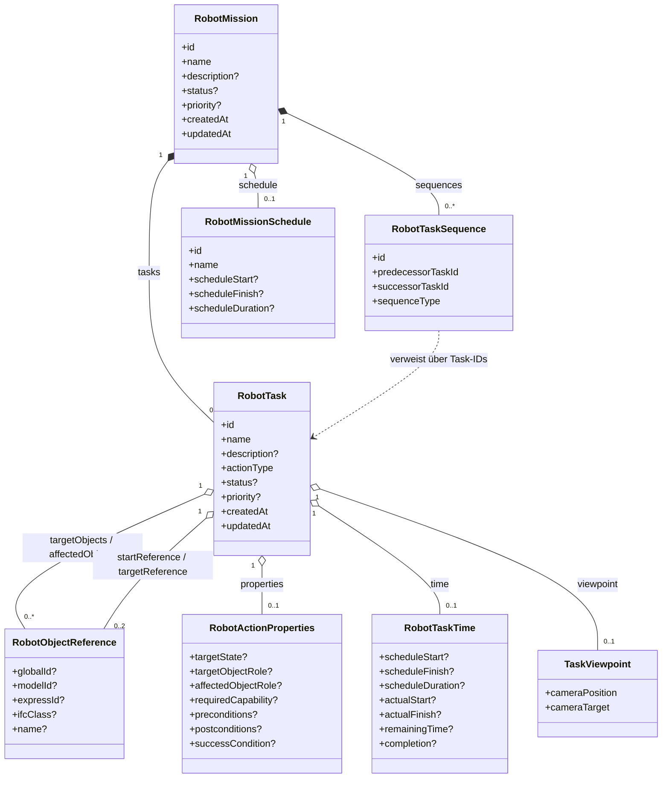
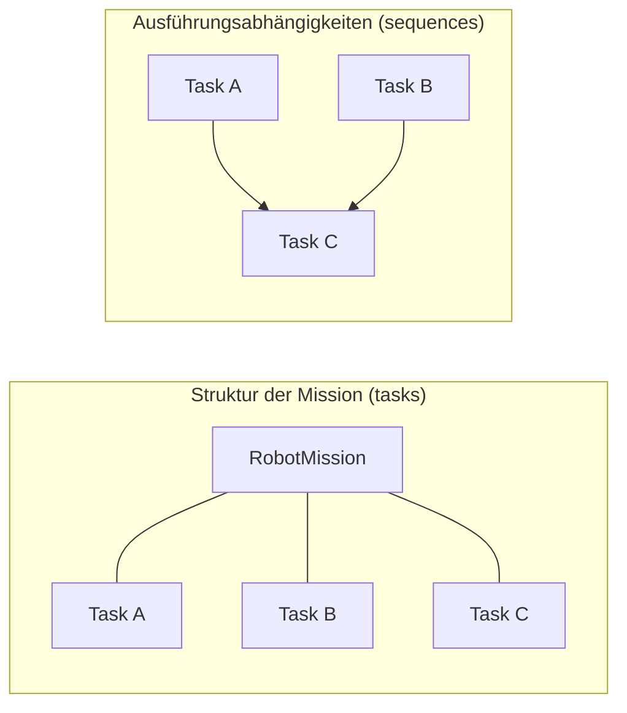

# Kapitel 4.2 – Internes Domänenmodell (Entwurf)

---

## A. Recherche- und Implementierungsnotiz

*(nicht Bestandteil der Masterarbeit)*

1. Geprüfter Stand: IFC-Editor zum Commit `674ede3bf2e7e6cf466bc4c16fe06c90fbb1753c`; Repository-Map `REPOSITORY_MAP_IFC_EDITOR_674ede3.md` gelesen (Abschnitte 6 Architektur, 8 Domänenmodell, 9 Application Layer, 17 Kapitelzuordnung).
2. `Strukturübersicht.txt` gelesen: 4.2 ist als Vorstellung von `RobotMission`, `RobotTask`, `RobotTaskSequence`, `RobotObjectReference`, `RobotActionProperties`, `RobotTaskTime`, `RobotMissionSchedule` vorgesehen; Kernaussage dort: `tasks` = hierarchisch enthaltene Schritte, `sequences` = explizite zeitliche Abhängigkeiten.
3. `repo_structure.txt` gelesen; alle im Kapitel verwendeten Pfade stammen ausschließlich daraus.
4. Untersuchte Quelldateien: `src/domain/robot-tasks/types.ts`, `builders.ts`, `sequencing.ts`, `validation.ts`; ergänzend `src/application/robot-tasks/index.ts`, `robotMissionService.ts`, `robotMissionSemanticComparison.ts`, `src/ifc/robot-tasks/mapper.ts`, `src/ifc/model-import/webIfcMissionReader.ts`, `src/viewer/robot-tasks/selection-adapter.ts` sowie eine Erhebung sämtlicher Importe auf `src/domain/robot-tasks/` über alle bereitgestellten Dateien.
5. Bestätigt: `RobotMission` führt `tasks: RobotTask[]` und `sequences: RobotTaskSequence[]` als getrennte Felder sowie optional `schedule?: RobotMissionSchedule`; `RobotTaskSequence` verweist ausschließlich über Task-IDs (`predecessorTaskId`, `successorTaskId`) auf Vorgänger und Nachfolger, nicht über Objektzeiger (`types.ts`).
6. Bestätigt: `RobotObjectReference` ist eine diskriminierte Union – entweder `globalId` (mit optionaler `expressId`) oder `modelId` **und** `expressId` als modelllokaler Fallback; `ifcClass` und `name` sind rein beschreibende Metadaten.
7. Bestätigt: Aktionssemantik liegt am Task (`RobotTask.properties`), nicht an der Objektreferenz. `validation.ts` erzwingt dies zusätzlich zur Laufzeit über den Code `OBJECT_ACTION_PROPERTIES_FORBIDDEN`.
8. Bestätigt: `RobotTaskTime` ist ein eigenes Feld `time` am Task und nicht Teil von `RobotActionProperties`; der Quellkommentar nennt als Begründung die spätere direkte `IfcTaskTime`-Abbildung.
9. Bestätigt: Alle Builder in `builders.ts` sind unveränderlich (Spread-Kopien), normalisieren Pflichttexte über `requireText` und werfen `RobotTaskDomainError`; `addTaskToMission` verhindert doppelte Task-IDs, `addUniqueReference` verhindert doppelte Objektzuweisungen.
10. Bestätigt: `sequencing.ts` enthält Zyklusprüfung (`hasTaskSequenceCycle`), Graphvalidierung (`validateTaskSequence`), topologische Ordnung mit Hierarchie als Tie-Breaker (`getTasksInExecutionOrder`) und die Erzeugung einer `FINISH_START`-Kette (`setMissionTaskExecutionOrder`).
11. Bestätigt: Die Domain-Schicht importiert ausschließlich innerhalb von `src/domain/robot-tasks/` – keine Referenzen auf Three.js, That Open Components, Fragments, `web-ifc`, DOM oder `localStorage`.
12. Bestätigt (neu): Die Abhängigkeitsrichtung verläuft ausnahmslos von außen zur Domäne. Auf `src/domain/robot-tasks/` greifen Application, Persistenz (`inMemoryMissionRepository.ts`, `localStorageMissionRepository.ts`, `selectableMissionRepository.ts`), Viewer (`selection-types.ts`, `selection-adapter.ts`, `viewer-object-selection-manager.ts`), IFC-Mapping, -Import, -Export und -Roundtrip (`mapper.ts`, `records.ts`, `webIfcMissionReader.ts`, `ifcModelExportService.ts`, `ifcMissionRoundtripCoordinator.ts` u. a.) sowie die UI (`robot-mission-tasks.ts`) zu; eine Gegenrichtung existiert nicht.
13. Bestätigt (neu): Der Application-Barrel `src/application/robot-tasks/index.ts` benennt diese Schichtung ausdrücklich – er exportiert nur Orchestrierungsdienste und Persistenz-Ports, während Viewer-Bibliotheken, Speicherimplementierungen und IFC-Mapper in den äußeren Schichten verbleiben.
14. Bestätigt (neu): Beide Roundtrip-Richtungen laufen über dieselbe Domänenvalidierung – sowohl der IFC-Import (`webIfcMissionReader.ts`) als auch das Mapping in Exportrichtung (`mapper.ts`) rufen `validateMission` auf. Der Viewer-Adapter (`selection-adapter.ts`) importiert That Open Components und `RobotObjectReference` gemeinsam und übersetzt Auswahlvorgänge in fachliche Referenzen.
15. Abgrenzungen und offene Punkte: Aktionsbedeutungen (4.3), Referenzierungsstrategie (4.4), Sequenzsemantik (4.5), Property Sets (4.7), Zeitsemantik (4.8), IFC-Mapping (4.9) und Validierungsregeln (4.10) werden nur benannt. Der Begriff „Aggregat-Root“ stammt aus der Repository-Map und nicht aus dem Code. `src/domain/robot-tasks/index.ts` liegt weiterhin nicht vor – das Repository enthält mehrere Ordner namens `robot-tasks`, und `robot-tasks_index.ts` entspricht dem **Application**-Barrel; der Domain-Barrel wird daher nur indirekt aus den Importanweisungen der Konsumenten erschlossen. Die Repository-Map merkt zudem an, dass `viewpoint` und `markerPosition` nicht vollständig in den Missionseditor integriert sind.

---

## B. Kapiteltext

### 4.2 Internes Domänenmodell

Aus den zuvor formulierten Modellierungszielen wird im Folgenden das interne Domänenmodell abgeleitet. Während Kapitel 4.1 begründet hat, *welche* fachlichen Sachverhalte überhaupt repräsentiert werden müssen, beschreibt dieses Unterkapitel, *wie* diese Sachverhalte innerhalb des Editors als typisierte Datenstruktur ausgedrückt werden. Leitend ist dabei die Frage, wie Robotermissionen unabhängig von IFC-Serialisierung, Viewer und Benutzeroberfläche fachlich repräsentiert werden können.

Das Domänenmodell bildet die fachliche Zwischenschicht des Systems. Es ist im Prototyp als eigenständige Modulgruppe unter `src/domain/robot-tasks/` umgesetzt und umfasst die Typdefinitionen (`types.ts`), die Erzeugungs- und Änderungsoperationen (`builders.ts`), die Sequenzlogik (`sequencing.ts`) sowie die Validierung (`validation.ts`). Dieser Zuschnitt ist bewusst gewählt: Weder die dreidimensionale Darstellung eines Gebäudemodells noch die konkrete IFC-Syntax sollen bestimmen, wie eine Mission fachlich beschrieben wird. Das Domänenmodell ist damit nicht ein technisches Zwischenformat, sondern die maßgebliche fachliche Beschreibung, aus der sowohl die Darstellung im Editor als auch die spätere IFC-Repräsentation abgeleitet werden. Abbildung 4.1 zeigt die Struktur des Modells im Überblick.

#### 4.2.1 Die Mission als übergeordnete Einheit

`RobotMission` bezeichnet eine vollständige Robotermission und bildet die übergeordnete Einheit des Modells, also diejenige Struktur, über die alle zugehörigen Informationen erreichbar sind und deren Konsistenz als Ganzes geprüft werden kann. In der Architekturdokumentation des Prototyps wird sie als Aggregat-Root bezeichnet; fachlich entscheidend ist, dass ausführbare Schritte, deren Abhängigkeiten und die optionale Zeitplanung nicht unabhängig voneinander existieren, sondern stets im Kontext genau einer Mission.

Eine Mission trägt eine stabile anwendungsseitige Kennung (`id`), einen menschenlesbaren Namen sowie eine optionale Beschreibung. Die Kennung ist ausdrücklich eine Anwendungs-ID und keine IFC-Identität; die Frage, wie beide Identitätsräume beim Export und Import aufeinander abgebildet werden, wird erst in Kapitel 4.4 und Kapitel 4.9 behandelt. Ergänzend führt die Mission einen aggregierenden Bearbeitungsstatus und eine Priorität. Bemerkenswert ist, dass Status und Priorität im Modell durch dieselben Typen beschrieben werden wie auf Task-Ebene; Mission und Task teilen damit dasselbe Vokabular für Lebenszyklus und Dringlichkeit, was den Aufbau der Bearbeitungsoberfläche vereinheitlicht.

Die eigentliche fachliche Substanz liegt in drei Feldern. `tasks` enthält die ausführbaren Einzelschritte der Mission, `sequences` die expliziten gerichteten Abhängigkeiten zwischen diesen Schritten, und `schedule` optional eine Zeitplanung der Mission als Ganzes. Hinzu kommen ein Erstellungs- und ein Änderungszeitstempel, die nachvollziehbar machen, wann eine Mission zuletzt bearbeitet wurde. Wesentlich ist, dass die Mission selbst keine Roboteraktion beschreibt: Sie ist Container und Klammer, nicht ausführbare Handlung. Jede konkrete Tätigkeit wird ausschließlich durch die enthaltenen Tasks ausgedrückt.

#### 4.2.2 Der Task als ausführbare Einheit

`RobotTask` bezeichnet einen ausführbaren Einzelschritt innerhalb einer Mission. Der Task ist die zentrale Struktur des Modells, weil er unterschiedliche Informationsbereiche zusammenführt, die im Modell dennoch klar getrennt bleiben.

Den fachlichen Kern bildet die Aktion: Jeder Task besitzt neben Kennung, Name und optionaler Beschreibung genau einen `actionType`, also die konkrete auszuführende Roboteraktion. Der zweite Bereich umfasst die Bezüge zu Gebäudeelementen. Hier unterscheidet das Modell zwischen `targetObjects` als unmittelbar adressierten oder als Kontext genutzten Objekten und `affectedObjects` als indirekt betroffenen Objekten; für Bewegungsaufgaben treten zusätzlich `startReference` und `targetReference` als Ausgangs- und Zielbezug hinzu. Der dritte Bereich sind die Aktionsparameter (`properties`), der vierte die zeitlichen Informationen (`time`). Als fünfter, optionaler Bereich können mit `viewpoint` und `markerPosition` annotationsbezogene Zusatzinformationen hinterlegt werden, die den Task im Viewer wiederauffindbar machen. Abgeschlossen wird die Struktur durch Status, Priorität und Zeitstempel.

Abstrahiert ergibt sich damit folgender Aufbau:

```text
RobotMission
├── Metadaten (id, name, status, priority, Zeitstempel)
├── tasks[]
├── sequences[]
└── schedule?

RobotTask
├── Aktion (actionType)
├── Objektbezüge (targetObjects, affectedObjects, start-/targetReference)
├── Aktionsparameter (properties)
├── Zeitinformationen (time)
└── optionale Viewerannotation (viewpoint, markerPosition)
```

Die Trennung dieser Bereiche ist keine bloße Ordnungsfrage. Sie erlaubt es, denselben Task schrittweise anzureichern – zunächst Aktion und Zielobjekt, später Parameter und Zeitplanung –, ohne dass unvollständige Zwischenstände strukturell unzulässig wären. Zugleich stellt sie sicher, dass die einzelnen Bereiche später auf unterschiedliche IFC-Konstrukte abgebildet werden können, ohne im Domänenmodell vermischt zu sein.

#### 4.2.3 Referenzen und ergänzende Wertobjekte

`RobotObjectReference` bezeichnet den fachlichen Verweis auf ein IFC-Objekt. Entscheidend ist, dass im Domänenmodell keine Viewer- oder Three.js-Objekte, keine Geometrie und keine Rendering-Handles gespeichert werden, sondern ausschließlich eine schlanke Identitätsbeschreibung. Bevorzugt wird die `globalId`, also die dauerhafte IFC-Objektidentität. Steht diese nicht zur Verfügung, ist ein modelllokaler Fallback aus `modelId` und `expressId` zulässig; die Typdefinition erzwingt dabei bereits auf Typebene, dass eine `expressId` ohne `globalId` nur zusammen mit der zugehörigen `modelId` verwendet werden kann, da Express-IDs nur innerhalb einer Modellserialisierung eindeutig sind. Ergänzend können mit `ifcClass` und `name` beschreibende Angaben zum Objekt geführt werden. Die vollständige Referenzierungsstrategie einschließlich ihrer Konsequenzen für Modellgrenzen und wiederholte Serialisierungen ist Gegenstand von Kapitel 4.4.

Wesentlich für das Verständnis des Modells ist, dass die Referenz bewusst frei von Aktionssemantik bleibt. Sie beantwortet die Frage, *welches* Bauteil gemeint ist, nicht die Frage, *was* mit ihm geschehen soll. Diese zweite Frage beantwortet `RobotActionProperties`, also die strukturierte Beschreibung der konkreten Aktionsanforderung eines Tasks. Dort können unter anderem ein angestrebter Zielzustand, die semantischen Rollen der adressierten und der betroffenen Objekte, eine erforderliche Roboterfähigkeit sowie Vor-, Nachbedingungen und ein Erfolgskriterium hinterlegt werden. Da diese Angaben am Task und nicht am Objekt hängen, kann dasselbe IFC-Objekt in verschiedenen Tasks mit unterschiedlichen Anforderungen verwendet werden – etwa eine Tür, die in einem Schritt geöffnet und in einem späteren wieder geschlossen wird. Die Bedeutung der einzelnen Aktionsarten wird in Kapitel 4.3 behandelt.

`RobotTaskTime` bezeichnet die zeitliche Beschreibung eines einzelnen Tasks und umfasst geplanten Start, geplantes Ende und geplante Dauer, den tatsächlichen Start und das tatsächliche Ende, die verbleibende Dauer sowie einen Fertigstellungsgrad. Diese Angaben sind bewusst nicht Teil von `RobotActionProperties`, obwohl beide Strukturen den Task ergänzen. Aktionsparameter beschreiben die fachliche Anforderung an die Ausführung und sind projektspezifisch; Zeitangaben beschreiben dagegen Planung und Fortschritt und entsprechen einem in IFC bereits vorhandenen Konzept, das in Kapitel 4.8 aufgegriffen wird. Die Trennung im Domänenmodell nimmt diese unterschiedliche Herkunft vorweg und vermeidet, dass Planungsdaten in einer projekteigenen Parameterstruktur verborgen werden.

Auf Missionsebene existiert mit `RobotMissionSchedule` eine optionale Zeitplanung für die Mission als Ganzes, bestehend aus Kennung, Name sowie geplantem Start, Ende und Dauer. Sie ersetzt die Task-Zeiten nicht, sondern beschreibt einen übergeordneten Rahmen: Der Task-Zeitbereich betrifft die Ausführung eines einzelnen Schritts einschließlich des tatsächlichen Verlaufs, die Missionsplanung dagegen ausschließlich die geplante zeitliche Einordnung des Gesamtvorgangs.

#### 4.2.4 Hierarchie und Ausführungsabhängigkeit als getrennte Strukturen

`RobotTaskSequence` bezeichnet eine eigenständige gerichtete Abhängigkeit zwischen zwei Tasks. Eine Sequenz besitzt eine eigene stabile Kennung, verweist über Task-IDs auf einen Vorgänger und einen Nachfolger und trägt einen Sequenztyp, der die Art der zeitlichen Beziehung angibt. Sequenzen sind damit eigenständige Elemente der Mission und keine Eigenschaft eines Tasks.

Daraus ergibt sich die für dieses Kapitel zentrale Unterscheidung: `RobotMission.tasks` beschreibt, welche ausführbaren Schritte zur Mission gehören, und legt zugleich deren deterministische Darstellungs- und Hierarchieordnung fest. `RobotMission.sequences` beschreibt demgegenüber, welche zeitlichen Abhängigkeiten zwischen diesen Schritten bestehen. Beide Strukturen ließen sich nicht ohne Informationsverlust durch ein einziges sortiertes Task-Array ersetzen. Ein Array kann ausschließlich eine lineare Folge ausdrücken; ein Abhängigkeitsgraph kann darüber hinaus unabhängige Zweige und mehrere Vorgänger desselben Nachfolgers darstellen. Zwei Tasks, die in beliebiger Reihenfolge oder parallel ausgeführt werden dürfen, sind in einem Array zwangsläufig geordnet, im Graphen dagegen korrekt als unabhängig beschreibbar. Abbildung 4.2 stellt beide Sichten einander gegenüber.

Die Implementierung behandelt beide Strukturen konsequent getrennt. Die Sequenzlogik prüft den Graphen auf Selbstbezüge, auf Verweise auf unbekannte Tasks und auf Zyklen und kann aus Hierarchie und Sequenzen eine ausführungsgerechte Reihenfolge ableiten, wobei die Hierarchieordnung als deterministisches Tie-Breaking-Kriterium für voneinander unabhängige Tasks dient. Legt eine Anwenderin oder ein Anwender eine rein lineare Reihenfolge fest, wird daraus eine vollständige Kette vom Typ `FINISH_START` erzeugt; auch dieser Fall wird jedoch als Sequenzgraph gespeichert und nicht auf die Array-Reihenfolge reduziert. Die inhaltliche Semantik der Sequenztypen sowie die Zyklusbehandlung im Detail sind Gegenstand von Kapitel 4.5.

#### 4.2.5 Domänenoperationen und Invarianten

Damit das Modell nicht nur beschreibend, sondern auch verlässlich ist, werden Domänenobjekte nicht frei zusammengesetzt, sondern über dedizierte Erzeugungs- und Änderungsoperationen gebildet. Missionen und Tasks entstehen über eigene Erzeugungsfunktionen, weitere Operationen fügen einer Mission Tasks hinzu, weisen Ziel- und betroffene Objekte zu, setzen Start- und Zielbezug einer Bewegungsaufgabe, ersetzen die Aktionsparameter oder die Zeitangaben eines Tasks.

Vier Eigenschaften dieser Operationen prägen das Modell. Erstens werden Eingaben normalisiert: Pflichttexte wie Kennungen und Namen werden bereinigt, und eine leere Angabe führt unmittelbar zu einem Domänenfehler statt zu einem strukturell gültigen, fachlich aber unbrauchbaren Objekt. Zweitens erzeugt jede Änderung eine neue Objektstruktur, statt bestehende Objekte zu verändern; Missionen und Tasks werden also als unveränderliche Werte behandelt, was Vergleiche zwischen einem beabsichtigten und einem rekonstruierten Zustand erst zuverlässig möglich macht. Drittens werden Eindeutigkeitsregeln früh durchgesetzt: Task-Kennungen müssen innerhalb einer Mission eindeutig sein, weil Sequenzen genau über diese Kennungen auflösen, und dieselbe Objektidentität wird einem Task nicht mehrfach zugewiesen. Viertens wird bei jeder Änderung der Änderungszeitpunkt fortgeschrieben.

Ergänzend prüft eine eigene Validierung die fachlichen Invarianten des Modells und meldet blockierende Fehler und nicht blockierende Warnungen als maschinen- und menschenlesbare Befunde. Für dieses Kapitel ist vor allem bemerkenswert, dass die Validierung die Trennung von Objekt und Aktion ausdrücklich absichert: Aktionsparameter, die an einer Objektreferenz statt am Task hinterlegt wurden – etwa aus deserialisierten Fremddaten –, werden als Verstoß gemeldet. Die vollständigen Regeln werden in Kapitel 4.10 dargestellt.

#### 4.2.6 Frameworkunabhängigkeit und gemeinsame Repräsentation im Roundtrip

Die Domänenschicht des Prototyps ist frei von direkten Abhängigkeiten zu Three.js, That Open Components, Fragments, `web-ifc`, Browser-Oberfläche und Browser-Persistenz; ihre Module verweisen ausschließlich aufeinander. Die Abhängigkeitsrichtung verläuft ausnahmslos von den äußeren Schichten zur Domäne: Anwendungsdienste, Persistenzadapter, Viewer-Adapter, IFC-Mapping sowie Import- und Exportmodule beziehen ihre Typen und Operationen aus der Domäne, während umgekehrt keine dieser Technologien in die Domäne gelangt. Der Viewer-Adapter etwa übersetzt eine Auswahl im dreidimensionalen Modell in eine `RobotObjectReference`; die Domäne kennt anschließend nur noch diese Referenz und nicht mehr das Auswahlobjekt, aus dem sie entstanden ist. Fachlich bedeutet dies, dass die Frage, wie eine Mission beschrieben wird, unabhängig davon beantwortet wird, wie sie dargestellt, gespeichert oder serialisiert wird:

```text
Viewer / UI
   ↓ Übersetzung
internes Domänenmodell
   ↓ Übersetzung
IFC / Persistenz
```

Die technische Umsetzung dieser Schichtung ist Gegenstand von Kapitel 5.1; für das Datenmodell selbst ist entscheidend, dass Auswahlmechanismen, Renderingstrukturen und Dateiformate keinen Eingang in die fachliche Beschreibung finden.

Diese Unabhängigkeit ist zugleich die Voraussetzung dafür, dass das Modell im implementierten IFC-Roundtrip als gemeinsamer Bezugspunkt dienen kann. Neu erstellte Missionen, aus einer annotierten IFC-Datei rekonstruierte Missionen, im Editor bearbeitete Missionen und erneut zu exportierende Missionen werden durch dieselben Typen beschrieben. Beide Richtungen des Austauschs greifen dabei nicht nur auf dieselben Typen, sondern auch auf dieselbe Domänenvalidierung zurück: Sowohl die Rekonstruktion einer Mission aus IFC als auch die Abbildung einer Mission auf IFC-nahe Strukturen prüfen das Ergebnis gegen die fachlichen Invarianten des Domänenmodells. Konzeptionell gilt damit: **IFC-Import und IFC-Export treffen sich im selben internen Domänenmodell.** Dass dieselbe Struktur beide Richtungen bedient, ist auch der Grund dafür, dass Hierarchie und Sequenzen getrennt geführt werden – nur so bleiben beide Informationen beim Rücklesen unterscheidbar. Die Implementierung von Import, Replacement-Export und semantischem Vergleich wird in Kapitel 5.9 beziehungsweise in der Evaluation behandelt.

#### Überleitung

Damit ist die allgemeine Struktur des internen Domänenmodells beschrieben. Im folgenden Kapitel wird die im `RobotTask` gekapselte Roboteraktionssemantik genauer betrachtet, insbesondere die unterstützten Aktionsarten und ihre fachliche Bedeutung.

---

## C. Kompakte Domänenübersicht

*(nicht Bestandteil der Masterarbeit)*

| Domänentyp | Fachliche Verantwortung | Wichtigste Beziehungen | Implementierungsdatei |
|---|---|---|---|
| `RobotMission` | Übergeordnete Mission; Container für ausführbare Schritte, Abhängigkeiten und optionale Zeitplanung; Metadaten und Zeitstempel | enthält `RobotTask[]` (`tasks`), enthält `RobotTaskSequence[]` (`sequences`), besitzt optional `RobotMissionSchedule` | `src/domain/robot-tasks/types.ts` |
| `RobotTask` | Ausführbarer Einzelschritt; führt Aktion, Objektbezüge, Aktionsparameter, Zeitangaben und optionale Viewerannotation zusammen | besitzt `RobotActionType`, referenziert `RobotObjectReference` (Ziel/betroffen/Start/Ziel), besitzt optional `RobotActionProperties` und `RobotTaskTime`, optional `TaskViewpoint` | `src/domain/robot-tasks/types.ts` |
| `RobotTaskSequence` | Gerichtete zeitliche Abhängigkeit zwischen zwei Tasks mit eigener stabiler Kennung | verbindet zwei `RobotTask` über `predecessorTaskId` / `successorTaskId`; besitzt `RobotTaskSequenceType` | `src/domain/robot-tasks/types.ts`, `sequencing.ts` |
| `RobotObjectReference` | Schlanke fachliche Identität eines IFC-Objekts ohne Aktions- oder Geometriedaten | wird von `RobotTask` referenziert; bevorzugt `globalId`, alternativ `modelId` + `expressId` | `src/domain/robot-tasks/types.ts` |
| `RobotActionProperties` | Konkrete Aktionsanforderung eines Tasks (Zielzustand, Rollen, Fähigkeit, Vor-/Nachbedingungen, Erfolgskriterium) | optionales Wertobjekt von `RobotTask`; ausdrücklich nicht an `RobotObjectReference` | `src/domain/robot-tasks/types.ts`, `validation.ts` |
| `RobotTaskTime` | Planungs- und Ausführungszeiten eines einzelnen Tasks inklusive Fertigstellungsgrad | optionales Wertobjekt von `RobotTask`; getrennt von `RobotActionProperties` | `src/domain/robot-tasks/types.ts` |
| `RobotMissionSchedule` | Optionale Zeitplanung der Mission als Ganzes | optionales Wertobjekt von `RobotMission` | `src/domain/robot-tasks/types.ts` |

---

## D. Nachweistabelle

*(nicht Bestandteil der Masterarbeit)*

| Aussage im Kapitel | Status | Implementierungsnachweis |
|---|---|---|
| `RobotMission` führt `tasks` und `sequences` als zwei getrennte Felder sowie optional `schedule` | direkt implementiert | `src/domain/robot-tasks/types.ts` (`interface RobotMission`) |
| Mission und Task teilen Status- und Prioritätsvokabular | direkt implementiert | `src/domain/robot-tasks/types.ts` (`RobotTaskStatus`, `RobotTaskPriority`) |
| Mission beschreibt selbst keine Roboteraktion | aus Implementierung abgeleitet | `types.ts`: `RobotMission` besitzt kein `actionType`-Feld |
| `RobotTask` bündelt Aktion, Objektbezüge, Parameter, Zeit und optionale Viewerannotation | direkt implementiert | `src/domain/robot-tasks/types.ts` (`interface RobotTask`) |
| Bezeichnung als „Aggregat-Root“ | Architekturinterpretation | Begriff aus `REPOSITORY_MAP_IFC_EDITOR_674ede3.md`, Abschnitt 8; im Quellcode nicht verwendet |
| `globalId` ist bevorzugt, `modelId` + `expressId` ist modelllokaler Fallback | direkt implementiert | `src/domain/robot-tasks/types.ts` (Union in `RobotObjectReference`), `validation.ts` (`OBJECT_MODEL_ID_REQUIRED`) |
| Aktionssemantik gehört an den Task, nicht an die Objektreferenz | direkt implementiert | `src/domain/robot-tasks/validation.ts` (`OBJECT_ACTION_PROPERTIES_FORBIDDEN`), `builders.ts` (`assignRobotActionProperties`) |
| Dasselbe IFC-Objekt kann in mehreren Tasks unterschiedlich verwendet werden | aus Implementierung abgeleitet | Folge der Trennung in `types.ts`/`builders.ts`; keine objektseitige Aktionsspeicherung |
| `RobotTaskTime` ist bewusst von `RobotActionProperties` getrennt | direkt implementiert | `src/domain/robot-tasks/types.ts` (getrennte Interfaces, Felder `properties` und `time`) |
| Task-IDs müssen innerhalb einer Mission eindeutig sein | direkt implementiert | `src/domain/robot-tasks/builders.ts` (`addTaskToMission`), `validation.ts` (`TASK_ID_DUPLICATE`) |
| Doppelte Objektzuweisungen werden vermieden | direkt implementiert | `src/domain/robot-tasks/builders.ts` (`addUniqueReference`, `referenceKey`) |
| Änderungen erzeugen neue Objektstrukturen statt Mutation; Änderungszeitpunkt wird fortgeschrieben | direkt implementiert | `src/domain/robot-tasks/builders.ts` (`touchTask`, Spread-Kopien in allen Zuweisungsoperationen) |
| Pflichttexte werden normalisiert und früh geprüft | direkt implementiert | `src/domain/robot-tasks/builders.ts` (`requireText`, `RobotTaskDomainError`) |
| Sequenzgraph wird auf Selbstbezug, unbekannte Tasks und Zyklen geprüft | direkt implementiert | `src/domain/robot-tasks/sequencing.ts` (`validateTaskSequence`, `hasTaskSequenceCycle`) |
| Aus linearer Nutzerreihenfolge entsteht eine `FINISH_START`-Kette | direkt implementiert | `src/domain/robot-tasks/sequencing.ts` (`setMissionTaskExecutionOrder`) |
| Hierarchieordnung dient als deterministisches Tie-Breaking bei unabhängigen Tasks | direkt implementiert | `src/domain/robot-tasks/sequencing.ts` (`getTasksInExecutionOrder`) |
| Ein Graph kann mehr ausdrücken als ein sortiertes Array | aus Implementierung abgeleitet | Interpretation der Graphstruktur in `sequencing.ts`; ggf. `[QUELLE ERFORDERLICH]` für die allgemeine graphentheoretische Aussage |
| Domänenschicht ist frei von Three.js, That Open, Fragments, `web-ifc`, UI und `localStorage` | direkt implementiert | Import-Header von `types.ts`, `builders.ts`, `sequencing.ts`, `validation.ts` (nur modulinterne Importe) |
| Abhängigkeitsrichtung verläuft ausnahmslos von außen zur Domäne | direkt implementiert | Importe auf `src/domain/robot-tasks/` in `src/application/robot-tasks/robotMissionService.ts`, `src/persistence/robot-tasks/localStorageMissionRepository.ts`, `src/viewer/robot-tasks/selection-types.ts`, `src/ifc/robot-tasks/mapper.ts`, `src/ifc/model-import/webIfcMissionReader.ts`, `src/ifc/model-export/ifcModelExportService.ts`, `src/ui-templates/sections/robot-mission-tasks.ts`; keine Gegenrichtung |
| Die Schichtung ist als öffentliche Modulschnittstelle dokumentiert | direkt implementiert | `src/application/robot-tasks/index.ts` (Barrel-Kommentar: nur Orchestrierungsdienste und Persistenz-Ports) |
| Der Viewer übersetzt Auswahlvorgänge in `RobotObjectReference`, ohne Viewer-Typen in die Domäne zu tragen | direkt implementiert | `src/viewer/robot-tasks/selection-adapter.ts` (importiert `@thatopen/components` und `RobotObjectReference`) |
| Import und Export treffen sich im selben Domänenmodell und derselben Domänenvalidierung | direkt implementiert | `validateMission`-Aufruf in `src/ifc/model-import/webIfcMissionReader.ts` und `src/ifc/robot-tasks/mapper.ts`; `src/application/robot-tasks/robotMissionSemanticComparison.ts` arbeitet auf denselben Domänentypen |
| Der Domain-Barrel bündelt Typen, Builder, Sequenzoperationen und Validierung zu einer öffentlichen Schnittstelle | aus Implementierung abgeleitet | Konsumenten importieren all dies gemeinsam über den Pfad `src/domain/robot-tasks`; `src/domain/robot-tasks/index.ts` selbst lag nicht vor |

---

## E. Abbildungen

### Abbildung 4.1 – Struktur des Domänenmodells

**Position:** nach dem zweiten Absatz des Kapitels (Abschnitt „Internes Domänenmodell“, vor 4.2.1); im Text bereits referenziert.



**Bildunterschrift:**
> Abbildung 4.1: Struktur des internen Domänenmodells mit `RobotMission` als übergeordneter Einheit sowie den enthaltenen Tasks, Sequenzen und ergänzenden Wertobjekten. Der Sequenztyp verweist ausschließlich über Task-Kennungen auf Vorgänger und Nachfolger. Eigene schematische Darstellung, abgeleitet aus `src/domain/robot-tasks/types.ts`.

### Abbildung 4.2 – Hierarchie gegenüber Ausführungsabhängigkeit

**Position:** in Abschnitt 4.2.4, nach dem Absatz zur Unterscheidung von `tasks` und `sequences`; im Text bereits referenziert.



**Bildunterschrift:**
> Abbildung 4.2: Gegenüberstellung der Missionsstruktur und der Ausführungsabhängigkeiten. Das `tasks`-Feld beschreibt die enthaltenen Schritte und ihre deterministische Darstellungsordnung, das `sequences`-Feld die gerichteten Abhängigkeiten zwischen ihnen. Die Tasks A und B sind hier voneinander unabhängig; diese Information ließe sich in einem rein linear sortierten Array nicht ausdrücken. Eigene schematische Darstellung.

*(Hinweis: Beide Abbildungen enthalten bewusst keine IFC-Entitäten, da deren Abbildung erst in den Kapiteln 4.5 und 4.9 behandelt wird.)*

---

## F. Offene Review-Punkte

1. **Begriff „Aggregat-Root“:** Der Terminus stammt aus der Repository-Map, nicht aus dem Code. Im Entwurf ist er als Architekturinterpretation eingeführt und sofort fachlich erläutert. Zu prüfen ist, ob die Arbeit diesen softwarearchitektonischen Begriff überhaupt einführen soll oder ob „übergeordnete Einheit“ ausreicht.
2. **Viewer-Felder im fachlichen Modell:** `viewpoint` und `markerPosition` sind viewer-nahe Felder in einer bewusst frameworkunabhängigen Schicht. Der Entwurf begründet sie mit der Wiederauffindbarkeit der Annotation; die Repository-Map merkt zugleich an, dass beide Felder nicht vollständig in den Editor integriert sind. Hier ist zu entscheiden, ob dieser Zustand in 4.2 offengelegt oder erst in Kapitel 5.11 als Einschränkung genannt wird.
3. **Abgrenzungstiefe zu 4.3–4.5 und 5.1:** Abschnitt 4.2.4 und der Absatz zu `RobotActionProperties` bewegen sich nah an den Folgekapiteln – zu prüfen ist, ob die Erwähnung von `FINISH_START` und des Türbeispiels bereits zu viel vorwegnimmt. Abschnitt 4.2.6 benennt inzwischen zusätzlich die konkreten Schichten (Viewer-Adapter, Persistenz, IFC-Module); das ist als Beleg der Frameworkunabhängigkeit gerechtfertigt, könnte aber je nach Ausgestaltung von Kapitel 5.1 dort doppelt erscheinen.
4. **Graphargument:** Die Aussage, dass ein Abhängigkeitsgraph mehr ausdrücken kann als eine lineare Ordnung, ist im Entwurf aus der Implementierung begründet. Falls sie stärker verankert werden soll, wäre hier eine graphentheoretische oder projektmanagementbezogene Quelle sinnvoll `[QUELLE ERFORDERLICH]`.
5. **Umgang mit den Zeitstempeln:** Der Entwurf nennt die Fortschreibung des Änderungszeitpunkts als Invariante. Im Code wird der Zeitstempel bei Objektzuweisungen auch dann aktualisiert, wenn die Zuweisung wegen Duplikatserkennung wirkungslos bleibt. Zu prüfen ist, ob dieses Detail für die Arbeit relevant ist oder bewusst außen vor bleiben soll.
