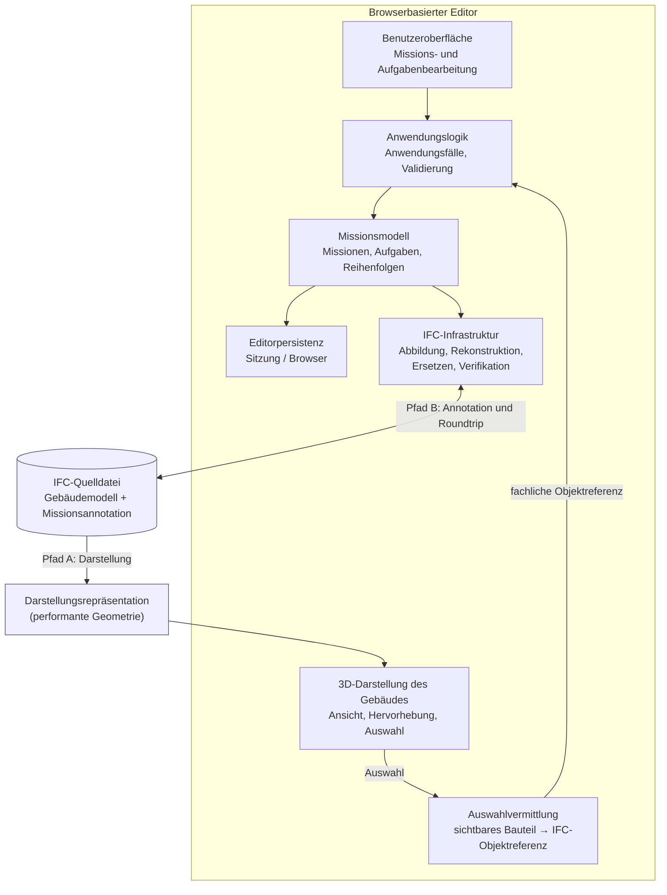
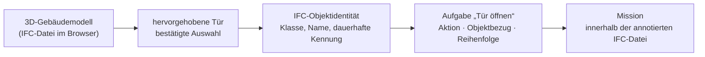

# Kapitel 5.1 „Gesamtarchitektur“ — Entwurf

---

# A. Recherche- und Implementierungsnotiz

*(nicht Bestandteil der Masterarbeit)*

1. **Geprüfter Commit:** `0248fa89c8747d73fe7fd630f3ce74d79f2e2f6e` (`0248fa8`) laut `commit-id notiz.txt`. Die Repository-Map beschreibt `674ede3`; die Map ist damit formal veraltet.
2. **Abgleich Map ↔ Code:** Alle für 5.1 relevanten Architekturmerkmale wurden stichprobenartig gegen den Quellcode verifiziert und gelten unverändert. Es wurden keine Abweichungen gefunden, die die Architekturaussagen von 5.1 berühren.
3. **Verwendete Strukturquelle:** Im Projektkontext liegt `Strukturübersicht.txt` (nicht `.md`) vor; Abschnitte 5.1–5.11 daraus als verbindliche Abgrenzung genutzt.
4. **Zusätzlich genutzt:** `repo_structure.txt` als Verzeichnisreferenz (vom Nutzer ausdrücklich benannt), `REPOSITORY_MAP_IFC_EDITOR_674ede3.md` als Orientierung.
5. **Untersuchte Architekturteile:** Composition Root, Domänenschicht, Anwendungsschicht, Viewer-/Auswahladapter, Persistenzfassade, IFC-Mapping, IFC-Import, IFC-Export, Roundtrip-Koordination, UI-Modellsektion.
6. **Bestätigt — Schichtentrennung:** Die Domänendateien importieren ausschließlich untereinander; kein Import von Three.js, Fragments, `web-ifc` oder Browser-APIs.
7. **Bestätigt — Composition Root:** Viewer, Auswahlkette, Repository-Fassade, Anwendungsservice, Import-, Export- und Roundtrip-Komponenten werden zentral in `src/main.ts` erzeugt und verdrahtet; die UI erhält sie als Zustand injiziert.
8. **Bestätigt — zwei Datenpfade:** Die Rendering-Repräsentation (Fragments) und die aufbewahrten IFC-Quellbytes sind getrennte Artefakte. Nur direkt geladene IFC-Dateien werden im Quellregister geführt.
9. **Bestätigt — Auswahl → fachliche Referenz:** Die Viewer-Auswahl wird über einen Adapter in eine reine Domänenreferenz (`GlobalId` bevorzugt, `modelId` + `expressId` als Fallback) überführt; die Anwendungsschicht erhält keine Viewer-Objekte.
10. **Bestätigt — Provenienz:** Express-ID-Gleichsetzung gilt nur für explizit registrierte direkte IFC-Importe, nicht für beliebige `.frag`-Modelle.
11. **Bestätigt — Exportsicherung:** Der Export prüft Quellzustand, Speichermodus, Modellzugehörigkeit der Referenzen, ersetzt den eigenen Missionsgraphen, importiert das Ergebnis erneut und vergleicht semantisch; erst danach werden die verifizierten Bytes als neue Quelle übernommen.
12. **Bestätigt — Strukturänderungssperre:** Fragments-Editieroperationen markieren das Modell als exportunsicher.
13. **Bestätigt — Persistenz:** In-Memory und `localStorage` sind aktiv; der Backend-Modus ist ein bewusst deaktivierter Platzhalter.
14. **Bestätigt — Nicht implementiert:** Keine Treffer für ROS-Anbindung, Waypoint-Generierung oder Surface Tiling im Quellcode.
15. **Hinweis:** Die Aktionsart `NAVIGATE_TO` existiert im Domänenmodell, bedeutet aber keine implementierte Navigationsberechnung — im Text entsprechend nicht als Robotikfunktion dargestellt.

---

# B. Kapitel 5.1 Gesamtarchitektur

*(Fließtext, ca. 1.250 Wörter)*

## 5.1 Gesamtarchitektur

Das vorangegangene Kapitel hat beschrieben, *was* modelliert wird: eine Robotermission als geordnete Menge von Aufgaben, die sich auf Bauteile eines Gebäudes beziehen, sowie deren Abbildung auf die Strukturen des IFC-Datenmodells. Das vorliegende Kapitel beschreibt, *wie* dieses fachliche Modell prototypisch in einem browserbasierten Editor umgesetzt wurde. Der Editor bildet dabei die Schnittstelle zwischen drei Größen, die zunächst wenig miteinander gemein haben: dem Anwender, der räumlich denkt und arbeitet; dem dreidimensional dargestellten Gebäudemodell, das für flüssige Interaktion optimiert ist; und der Missionsannotation, die dauerhaft und werkzeugübergreifend austauschbar sein muss.

Der Ausgangspunkt der Architektur lässt sich an einem einfachen Vorgang verdeutlichen. Ein Anwender betrachtet ein Gebäude im Browser, dreht die Ansicht, erkennt eine bestimmte Tür und klickt sie an. Er möchte festhalten, dass ein Roboter genau diese Tür öffnen soll. Für den Editor ist dieser Klick jedoch zunächst nur ein Treffer auf einer Dreiecksfläche innerhalb einer Darstellungsstruktur. Was der Anwender meint, ist etwas anderes: ein fachlich identifizierbares Bauteil des Gebäudemodells. Die Anwendung übernimmt deshalb nicht die dargestellte Geometrie als Missionsinformation, sondern löst die visuelle Auswahl auf das zugehörige IFC-Objekt auf und hinterlegt lediglich eine fachliche Referenz auf dieses Objekt in der Aufgabe. Diese Unterscheidung zwischen dem, was sichtbar ist, und dem, was fachlich gespeichert wird, prägt den gesamten technischen Aufbau des Editors.

### Verantwortungsbereiche

Der Editor ist in wenige klar abgegrenzte Verantwortungsbereiche gegliedert, deren Abhängigkeiten nach innen, also auf das fachliche Missionsmodell hin, gerichtet sind.

Die **Benutzeroberfläche und die dreidimensionale Darstellung** verantworten die Anzeige des Gebäudemodells, die Kamerasteuerung, die Hervorhebung von Bauteilen sowie die Bedienelemente zur Bearbeitung von Missionen und Aufgaben. Sie lösen außerdem Import- und Exportvorgänge aus. Bewusst nicht Teil dieser Ebene ist die fachliche Missionslogik: Die Oberfläche erzeugt keine eigene, parallele Wahrheit über den Missionszustand, sondern stellt den Zustand dar, der von der darunterliegenden Anwendungsschicht verwaltet wird.

Der **Viewer- und Auswahlbereich** vermittelt zwischen sichtbarer Geometrie und fachlicher Objektidentität. Er ermittelt, welche Bauteile an einer Bildschirmposition getroffen wurden, löst zu einem getroffenen Element die zugehörigen IFC-Metadaten auf und überführt eine vom Anwender bestätigte Auswahl in eine stabile, fachliche Objektbeschreibung. Der Weg vom sichtbaren Bauteil zur Missionsinformation verläuft damit stufenweise:

```text
sichtbares Bauteil im dargestellten Gebäude
        ↓
Auswahl und Bestätigung durch den Anwender
        ↓
Auflösung des zugehörigen IFC-Objekts
        ↓
fachliche Objektreferenz innerhalb einer Aufgabe
```

Entscheidend ist die letzte Stufe: Was die Mission speichert, ist keine Bildschirmkoordinate und kein Darstellungsobjekt, sondern eine Identität, die auch dann noch gilt, wenn die Darstellung längst verworfen wurde.

Die **Anwendungs- und Domänenschicht** enthält das fachliche Missionsmodell und die darauf definierten Operationen: das Anlegen und Ändern von Missionen und Aufgaben, die Zuordnung von Aktionen und Objektbezügen, die Verwaltung von Ausführungsreihenfolgen sowie die Validierung. Diese Schicht ist bewusst frei von Abhängigkeiten zur Darstellungstechnologie und zur konkreten IFC-Serialisierung. Eine Mission kann daher aufgebaut, verändert und auf Widerspruchsfreiheit geprüft werden, ohne dass ein Renderer, ein Browserfenster oder ein IFC-Parser vorhanden sein muss. Praktisch bedeutet dies, dass die fachlichen Regeln des Annotationsmodells isoliert prüfbar bleiben und nicht mit Fragen der Darstellung oder der Dateiformatierung vermischt werden.

Die **Persistenz** hält den Bearbeitungszustand des Editors. Umgesetzt sind eine rein flüchtige Ablage für die laufende Sitzung sowie eine optionale Speicherung im Browser, die eine Bearbeitung über das Schließen des Fensters hinaus erlaubt. Eine serverseitige Speicherung ist nicht Bestandteil des Prototyps; sie ist in der Architektur zwar als austauschbarer Zielbereich vorgesehen, aber nicht verfügbar. Wesentlich für das Verständnis der Gesamtarchitektur ist, dass diese Speicherung den *Editorzustand* betrifft und nicht den fachlichen Träger der Annotation. Letzterer bleibt die IFC-Datei.

Die **IFC-Infrastruktur** fasst schließlich alle Aufgaben zusammen, die den Austausch mit der IFC-Datei betreffen: die Abbildung zwischen Missionsmodell und IFC-Strukturen, die Rekonstruktion bereits vorhandener Missionsannotation aus einer geladenen Datei, das Schreiben beziehungsweise Ersetzen der eigenen Annotation, die Zuordnung einer bearbeiteten Mission zu ihrer ursprünglichen Quelldatei sowie die abschließende Verifikation des Ergebnisses.

### Zwei getrennte, aber verbundene Datenpfade

Eine wesentliche Entwurfsentscheidung besteht darin, dass dieselbe IFC-Datei im Editor auf zwei unterschiedlichen Ebenen verarbeitet wird.

Der erste Pfad dient der Darstellung und der Interaktion. Die IFC-Datei wird in eine für das Rendering optimierte Repräsentation überführt, aus der das Gebäude im Browser aufgebaut wird. Auf dieser Repräsentation finden Kamerabewegungen, Hervorhebungen und die Auswahl von Bauteilen statt. Ihr Zweck ist Bedienbarkeit und Darstellungsgeschwindigkeit.

Der zweite Pfad dient der fachlichen Annotation. Er arbeitet nicht auf der Darstellungsrepräsentation, sondern auf den beim Laden aufbewahrten ursprünglichen IFC-Daten. Aus ihnen wird beim Öffnen einer Datei eine gegebenenfalls bereits vorhandene Missionsannotation rekonstruiert, und in sie wird beim Export die aktuelle Annotation zurückgeschrieben.

Beide Pfade beziehen sich auf dasselbe Gebäude, erfüllen aber unterschiedliche Aufgaben und werden deshalb nicht gleichgesetzt. Die Darstellung ist das Medium, über das der Anwender das Gebäude begreift und auswählt; die aufbewahrte IFC-Quelle ist die Grundlage, auf der die Annotation verlässlich ausgetauscht wird. Verbunden werden beide Pfade genau an einer Stelle, nämlich dort, wo eine visuelle Auswahl in eine fachliche Objektreferenz übersetzt wird. Aus dieser Trennung folgt auch eine bewusste Einschränkung: Werden an der Darstellungsrepräsentation strukturelle Änderungen vorgenommen, entspricht sie nicht mehr der aufbewahrten Quelle, und der Editor verweigert für dieses Modell den Export, statt ein möglicherweise verfälschtes Ergebnis zu erzeugen.

### Der Weg einer Aufgabe durch die Architektur

Der Zusammenhang der beschriebenen Bereiche lässt sich am Beispiel einer Aufgabe „Tür öffnen“ nachvollziehen. Zunächst wird eine IFC-Datei geladen; das Gebäude erscheint im Browser, und der Editor prüft im Hintergrund, ob die Datei bereits eine eigene Missionsannotation enthält, die er rekonstruieren kann. Der Anwender wählt anschließend im Gebäudemodell eine konkrete Tür aus und bestätigt diese Auswahl. Die bestätigte Auswahl wird auf das zugehörige IFC-Objekt zurückgeführt und als fachliche Referenz einer Aufgabe der Mission zugeordnet, die als Aktion das Öffnen vorsieht. Von diesem Zeitpunkt an verwaltet die Missionslogik Aktion, Objektbezug und Reihenfolge unabhängig davon, wie das Gebäude gerade dargestellt wird oder ob es überhaupt sichtbar ist. Beim Export wird die Mission wieder mit derjenigen IFC-Quelldatei verknüpft, aus der das Gebäude stammt. Das Ergebnis ist eine IFC-Datei, die weiterhin das vollständige Gebäudemodell enthält und zusätzlich die Missionsannotation trägt.

### Roundtrip als Bestandteil der Architektur

Der beschriebene Austausch ist nicht einseitig, sondern als geschlossener Zyklus umgesetzt:

```text
annotierte IFC-Datei
        ↓
Rekonstruktion der Mission
        ↓
internes Missionsmodell
        ↓
Bearbeitung im Editor
        ↓
Export in die IFC-Quelle
        ↓
erneutes Einlesen und semantischer Abgleich
        ↓
verifizierte annotierte IFC-Datei
```

Der Export ist damit keine bloße Ergänzung der Datei. Der aktuelle Zustand des Editors ist für die eigene Annotation der jeweiligen Quelldatei maßgebend, sodass entfernte Missionen tatsächlich verschwinden und wiederholte Exportvorgänge keine Duplikate ansammeln. Bevor ein Ergebnis akzeptiert wird, liest der Editor die erzeugte Datei erneut ein und vergleicht die daraus rekonstruierte Mission mit derjenigen, die geschrieben werden sollte.

Hervorzuheben ist der Geltungsbereich dieses Zyklus: Er betrifft ausschließlich die projekteigene Missionsannotation. Der Editor ist kein allgemeines IFC-Autorenwerkzeug und beansprucht keinen verlustfreien Roundtrip beliebiger Geometrie- oder Strukturänderungen am Gebäudemodell. Bestehende Gebäudeobjekte bleiben unverändert und behalten ihre Identität.

### Einordnung

Die vorgestellte Gliederung verfolgt vier Ziele. Erstens bleiben die technischen Randbereiche austauschbar: Darstellungstechnologie, Speicherort und IFC-Anbindung sind über abstrahierte Schnittstellen angebunden. Zweitens bleibt die fachliche Logik isoliert prüfbar, da sie ohne Renderer und ohne IFC-Laufzeit ausführbar ist. Drittens wird die Annotation von der Darstellung entkoppelt, sodass Bearbeitungsstand und Darstellungszustand nicht miteinander verwechselt werden können. Viertens erlaubt die Trennung von Darstellungsrepräsentation und aufbewahrter Quelle einen kontrollierten Austausch, bei dem der Editor Bedingungen benennen kann, unter denen er einen Export bewusst verweigert.

Die folgenden Unterkapitel vertiefen die hier nur im Überblick genannten Aspekte: die eingesetzten Technologien, den Modellimport und das Rendering, die Auswahl von IFC-Objekten und deren Überführung in fachliche Referenzen, den Bedienablauf der Annotation, den Missions- und Aufgabeneditor, die Speicherung während der Bearbeitung sowie die IFC-Export- und Roundtrip-Pipeline.

---

# C. Abbildungen

## Abbildung 5.1 — Gesamtarchitektur

**Position:** nach dem Abschnitt „Verantwortungsbereiche“, vor „Zwei getrennte, aber verbundene Datenpfade“.

**Bildunterschrift:** *Abbildung 5.1: Schematische Gesamtarchitektur des browserbasierten IFC-Missionseditors und zentrale Datenflüsse zwischen Gebäudemodell, Missionsdomäne und IFC-Persistenz (eigene Darstellung).*

**Zweck:** Zeigt die Verantwortungsbereiche, die nach innen gerichteten Abhängigkeiten und beide Datenpfade in einem Bild. Keine Dateinamen in den Boxen.



## Abbildung 5.2 — Bezug zwischen Gebäude und Annotation

**Position:** nach dem Abschnitt „Der Weg einer Aufgabe durch die Architektur“.

**Empfohlene Umsetzung: echter Editor-Screenshot mit Callouts.** Ich kann die Anwendung nicht ausführen und erfinde daher bewusst keine Oberflächendarstellung. Nimm den Screenshot bitte selbst nach folgender Anweisung auf.

**Aufnahmeanweisung**

* **Modell:** `IFC/01_Haus.ifc` (überschaubar und gut lesbar) oder ein aussagekräftiger Ausschnitt aus `03_Institute.ifc`.
* **Kameraperspektive:** leicht erhöhte Schrägansicht (etwa 30–40° über der Horizontalen), so nah, dass die gewählte Tür klar erkennbar ist, aber noch genug Wandkontext sichtbar bleibt, damit man das Bauteil als Teil eines Gebäudes liest. Keine reine Frontalansicht.
* **Auswahlzustand:** eine Tür im Zustand *bestätigte Auswahl* (nicht Hover, nicht Kandidatenvorschau), damit die Hervorhebungsfarbe der bestätigten Auswahl sichtbar ist.
* **Sichtbare Panels:** links/seitlich das Metadatenpanel mit IFC-Klasse und Name des gewählten Bauteils; daneben das Missionspanel mit einer Mission, die genau eine Aufgabe mit der Aktion `OPEN` und dieser Tür als Zielobjekt enthält.
* **Layout:** Viewer und Missionspanel gleichzeitig im Bild; Fensterbreite so wählen, dass die Aufgabenkarte nicht abgeschnitten ist.
* **Nachträgliche Callouts (drei genügen):**
  * ① am hervorgehobenen Bauteil im 3D-Modell → „IFC-Bauteil im Gebäude“
  * ② am Metadatenpanel → „aufgelöste IFC-Identität“
  * ③ an der Aufgabenkarte → „Objektbezug in der Aufgabe“
  * optional ein dünner Verbindungspfeil ① → ③
* **Hinweis:** Persönliche Dateipfade, Nutzernamen oder Browserleisten vor der Aufnahme ausblenden oder zuschneiden.

**Bildunterschrift (Screenshot-Variante):** *Abbildung 5.2: Zusammenhang zwischen ausgewähltem Gebäudeelement und Missionsannotation im implementierten Editor. Die bestätigte Auswahl einer Tür (①) wird auf ihre IFC-Identität aufgelöst (②) und als Objektbezug einer Aufgabe der Mission zugeordnet (③). Screenshot der eigenen Implementierung, Callouts ergänzt.*

**Ersatzvariante, falls kein Screenshot verfügbar ist** — ausdrücklich als schematische Darstellung zu kennzeichnen:



**Bildunterschrift (Schema-Variante):** *Abbildung 5.2: Schematische Darstellung des Zusammenhangs zwischen einem ausgewählten Gebäudeelement und der zugehörigen Missionsannotation (eigene Darstellung; kein Screenshot der Implementierung).*

---

# D. Implementierungsnachweistabelle

*(nicht Bestandteil der Masterarbeit; Stand Commit `0248fa8`)*

| Architekturaussage | Repository-Pfad / Implementierung | Status |
|---|---|---|
| Zentrale Verdrahtung aller Bereiche an einer Stelle | `src/main.ts` (Composition Root: Viewer, Auswahlkette, Repository-Fassade, Anwendungsservice, Import/Export/Roundtrip, UI-Zustand) | bestätigt |
| Domänenmodell ohne Abhängigkeit zu Rendering, Browser und IFC-Syntax | `src/domain/robot-tasks/{types,builders,sequencing,validation}.ts` — Importe ausschließlich modulintern | bestätigt (per Import-Prüfung) |
| Oberfläche erzeugt keine parallele Missionswahrheit | `src/ui-templates/sections/robot-mission-tasks.ts` nutzt `RobotMissionService`; UI-Zustand wird aus `main.ts` injiziert | bestätigt |
| Viewer-Auswahl wird in fachliche Objektreferenz überführt | `src/viewer/robot-tasks/selection-adapter.ts` (`convertViewerSelectionItemToRobotObjectReference`), `selection-metadata.ts`, `viewer-object-selection-manager.ts` | bestätigt |
| `GlobalId` bevorzugt, `modelId` + `expressId` als Fallback | `selection-adapter.ts`, `src/domain/robot-tasks/types.ts` (`RobotObjectReference`) | bestätigt |
| Express-ID-Gleichsetzung nur für direkt geladene IFC-Modelle | `src/viewer/robot-tasks/model-provenance.ts` (`DirectIfcModelProvenance`) | bestätigt |
| Trennung Rendering-Repräsentation ↔ aufbewahrte IFC-Quelle | `src/ifc/model-export/ifcSourceModelRegistry.ts` vs. `@thatopen/fragments`-Modelle in `main.ts` | bestätigt |
| Strukturelle Fragments-Änderungen sperren den Export | `main.ts`: `fragments.core.editor.onEdit` → `ifcSourceRegistry.markStructurallyChanged`; Prüfung in `ifcModelExportService.ts` | bestätigt |
| Missionsimport folgt auf direkten IFC-Import | `src/ui-templates/sections/models.ts` (Registrierung der Quellbytes → `importLoadedModelMissions`), `src/ifc/model-roundtrip/loadedModelMissionImport.ts` | bestätigt |
| Reines Mapping Domäne → IFC-Records ohne `web-ifc` | `src/ifc/robot-tasks/{mapper,records,annotationSchema}.ts` | bestätigt |
| Rekonstruktion vorhandener Annotation aus IFC | `src/ifc/model-import/{ifcMissionImportService,webIfcMissionReader}.ts` | bestätigt |
| Export ersetzt den eigenen Missionsgraphen statt anzuhängen | `src/ifc/model-export/webIfcMissionReplacer.ts`, `webIfcStructuralCodec.ts`, `ifcModelExportService.ts` (`replaceMissionsAndValidate`) | bestätigt |
| Export wird durch erneuten Import semantisch geprüft | `src/ifc/model-roundtrip/ifcMissionRoundtripCoordinator.ts` (`exportModel` → `importer.import` → `compareRobotMissionsSemantically`) | bestätigt |
| Verifizierte Bytes werden neue Quelle (Source Advancement) | `ifcMissionRoundtripCoordinator.ts` → `sources.replaceVerifiedBytes` | bestätigt |
| Modellfremde Objektreferenzen blockieren den Export | `ifcMissionRoundtripCoordinator.ts` (`CROSS_MODEL_MISSION_REFERENCE`) | bestätigt |
| Editorpersistenz austauschbar; Backend deaktiviert | `src/persistence/robot-tasks/selectableMissionRepository.ts` (`isAvailable(mode) === mode !== "backend"`) | bestätigt |
| Editorzustand ≠ fachlicher IFC-Inhalt | Quellbytes nur in `ifcSourceModelRegistry.ts` (Sitzung), Missionen in `localStorageMissionRepository.ts` | bestätigt |
| Kein allgemeiner IFC-Struktur-Roundtrip | `ifcModelExportService.ts` (Ablehnung reiner `.frag`-Modelle und struktureller Änderungen) | bestätigt |
| Keine ROS-Anbindung, Waypoint-Generierung oder Surface Tiling | keine Treffer im Quellcode | bestätigt (Negativbefund) |

---

# E. Review des Professorenfeedbacks

**1. Stehen Quellcodedetails im Text noch zu stark im Vordergrund?**

Nein. Der Kapiteltext nennt keine einzige Quelldatei, keine Klasse, kein Interface und keine Funktion. Auch Bezeichner aus dem Domänenmodell erscheinen nicht mehr in Codeschreibweise — es ist durchgängig von „Mission“, „Aufgabe“, „Objektreferenz“ und „Aktion“ die Rede. Sämtliche Implementierungsbelege sind in Teil D ausgelagert. Zwei bewusste Ausnahmen: die Aktionsbezeichnung `OPEN` in der Screenshot-Anweisung (Teil C, nicht Kapiteltext) und die Modelldateinamen ebendort.

*Mögliche weitere Verbesserung:* Falls Du im Fließtext auch die Technologienamen (Fragments, `web-ifc`, Three.js) vermeiden möchtest — der Entwurf nennt sie derzeit gar nicht, sondern spricht von „Darstellungsrepräsentation“ und „IFC-Laufzeit“. Prüfe, ob Dir das für 5.1 zu abstrakt ist; ein einzelner Satz mit den Technologienamen als Vorgriff auf 5.2 wäre vertretbar.

**2. Ist der Bezug zwischen Annotation und konkretem IFC-Gebäude anschaulich genug?**

Weitgehend ja. Der Gebäudebezug trägt den Text an vier Stellen: im Einstieg (Tür-Klick als Ausgangsproblem), in der stufenweisen Auflösungskette, im durchgängigen Beispiel „Tür öffnen“ und in Abbildung 5.2.

*Konkrete Verbesserung:* Der wirksamste Hebel ist der echte Screenshot. Eine schematische Grafik zeigt erneut nur Kästen; ein Screenshot zeigt gleichzeitig ein reales Gebäude, ein reales Bauteil und die reale Annotation. Solange Abbildung 5.2 nur schematisch bleibt, ist das Feedback nur zur Hälfte adressiert.

**Bildstrategie — kurze Bewertung**

| Variante | Bewertung |
|---|---|
| Echter Screenshot ohne Callouts | Zeigt Gebäudebezug und Implementierung, lässt aber offen, welche Bildbereiche zusammengehören. |
| Rein schematische Grafik | Zuverlässig herstellbar, aber gerade das abstrakte Kastendenken, das der Professor kritisiert. Nur Rückfallebene. |
| **Screenshot + wenige Callouts** | **Empfohlen.** Belegt zugleich den Implementierungsstand und macht den Weg vom Bauteil zur Annotation im Bild nachvollziehbar. Drei Callouts genügen; mehr überfrachten. |

---

# F. Offene Review-Punkte

1. **Commit-Diskrepanz klären.** Die Repository-Map beschreibt `674ede3`, die Arbeitskopie steht auf `0248fa8`. Für 5.1 relevante Merkmale wurden gegen den Code geprüft und gelten weiterhin; für spätere Kapitel solltest Du die Map aktualisieren oder den in der Arbeit zitierten Commit vereinheitlichen.

2. **Abgrenzung 5.1 ↔ 5.9 beim Roundtrip.** Der Roundtrip-Abschnitt in 5.1 nennt bereits Ersetzen statt Anhängen und die Verifikation per Reimport. Prüfe beim Vergleich mit Deinem 5.9-Entwurf, ob das dort nicht zu wörtlich wiederholt wird — 5.1 soll nur den Zyklus als Architekturbestandteil zeigen, nicht dessen Ablauf.

3. **Abgrenzung 5.1 ↔ Kapitel 4.11.** Die Aussage „kanonischer fachlicher Träger ist die annotierte IFC-Datei, der Browserspeicher hält nur den Editorzustand“ steht laut Strukturübersicht auch in 4.11. In 5.1 ist sie bewusst kurz gehalten; kontrolliere, dass sie dort nicht als Neuformulierung derselben Entscheidung wirkt.

4. **Screenshot beschaffen und Abbildungsvariante festlegen.** Kapitel und Bildunterschrift liegen in zwei Fassungen vor. Entscheide früh, welche Du verwendest, da Abbildung 5.2 der zentrale Hebel für das Professorenfeedback ist.

5. **`NAVIGATE_TO` bleibt heikel.** Diese Aktionsart existiert im Domänenmodell, es gibt aber keine Navigationsberechnung. Der Entwurf erwähnt sie deshalb nicht. Achte darauf, dass sie auch in 5.6/5.7 nicht versehentlich als implementierte Robotikfunktion gelesen werden kann — das ist derselbe offene Punkt, der schon in Kapitel 4 markiert war.
